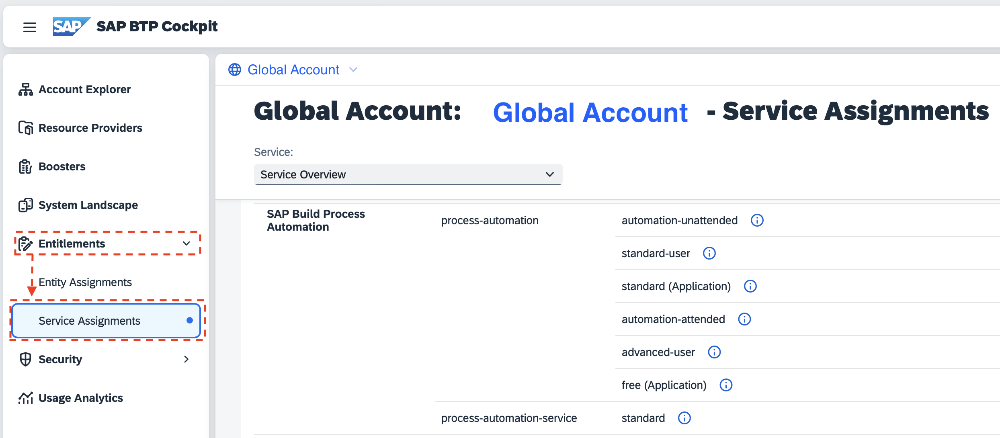
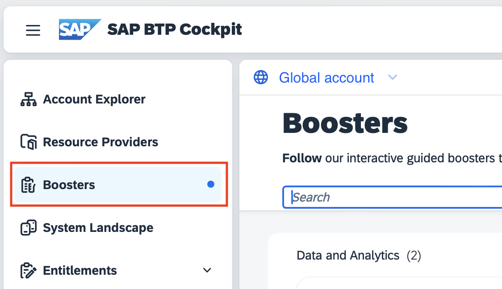
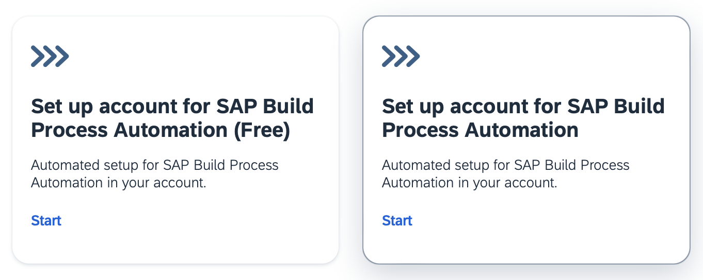
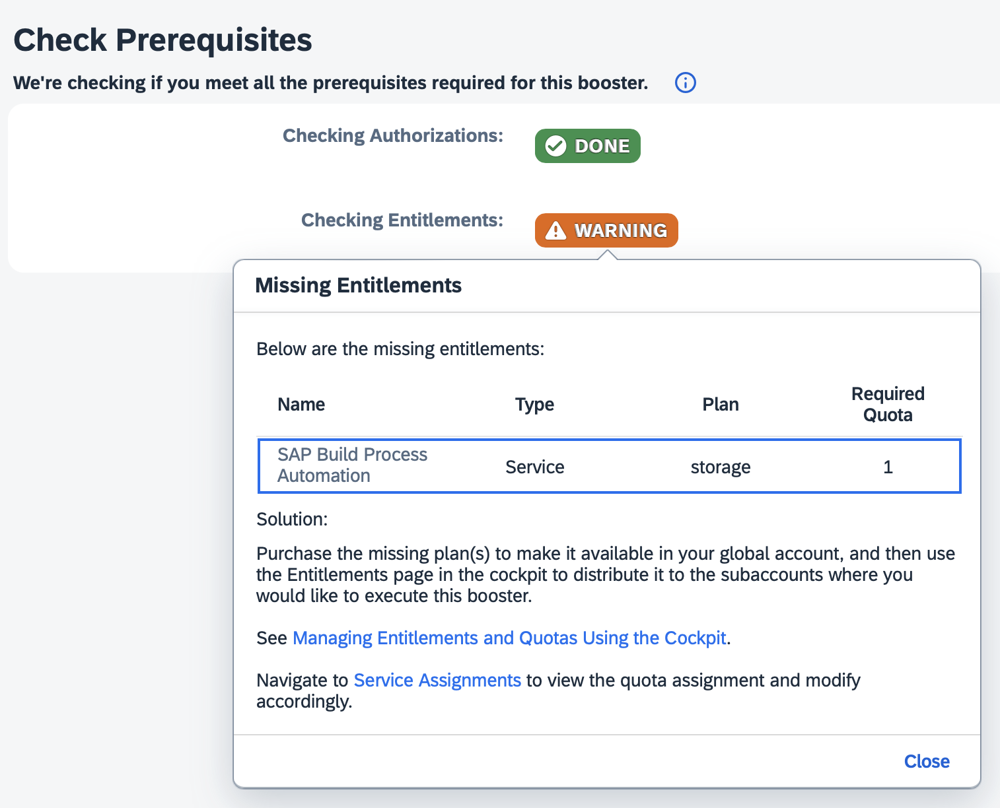
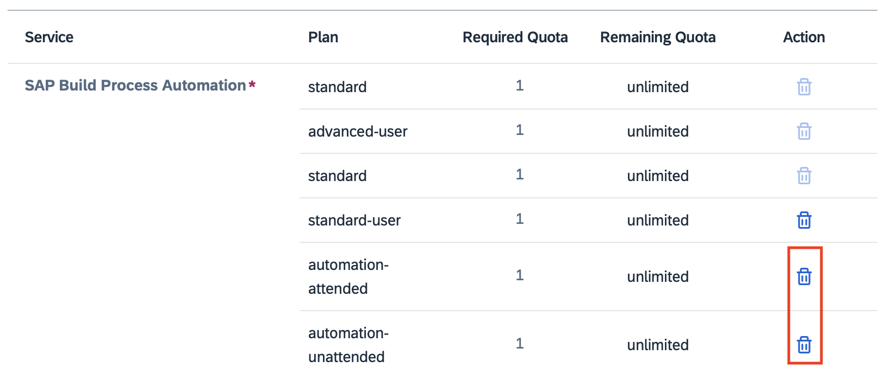

# Setting up subaccount for SAP Build Process Automation

---

## 1. Verify entitlements

To use _SAP Build Process Automation_, your global account must have some service plans available.

From your _Global Account_, go to _Entitlements_ -> _Service Assignments_. 

Scroll down to _SAP Build Process Automation_.

- **standard (Application)**: This is the subscription service, to access _SAP Build Lobby_.
- **advanced-user**: They can design, monitor, or administrate the solution.
- **standard-user**: They are process participants who trigger, approve, or contribute to a process instance.
- **standard** (_process-automation-service_): Allows you to create a service instance when coupled with the standard (Application) entitlement.

The following entitlements are optional and not needed for this scenario:

- **storage**: Allows you to increase the storage quota if needed.
- **api-calls**: Allows you to increase the API calls quota if needed.
- **automation-attended**: Allows you to use automations (bots) in attended mode, which means users have the agent installed in their machines.
- **automation-unattended**: Allows you to use automations (bots) in unattended mode, which means the bot runs in the background.

> If you want to try _SAP Build Process Automation_ using the _free tier_, these are the relevant entitlements:
> 
> - **free (Application)**: This is the subscription service, to access _SAP Build Lobby_.
> - **standard** (_process-automation-service_): Allows you to create a service instance when coupled with the free (Application) entitlement.
> 

## 2. Run the Booster

Using _Boosters_, you can configure _SAP Build Process Automation_ in a new or an existing subaccount. 

From your _Global Account_, go to _Boosters_:

Search for `build process` to filter the results.

Below are the links to the official documentation on this process, we recommend you read them together with this page when running the booster:

- [Set up account for SAP Build Process Automation](https://help.sap.com/docs/build-process-automation/sap-build-process-automation/subscribe-to-sap-build-process-automation-standard-plan?locale=en-US): to use the standard plan
- [Set up account for SAP Build Process Automation (Free)](https://help.sap.com/docs/build-process-automation/sap-build-process-automation/get-free-access-to-sap-build-process-automation?locale=en-US): to use _free tier_

### Booster steps

The wizard will take you over the following steps:

1. Verify you are a global account or directory admin, and verify entitlements are available

    > [!WARNING]
    > You can ignore warnings of optional entitlements (_storage_, _api-calls_, _automation-attended_, _automation-unattended_)
    > 
    > 
    
2. Choose a new subaccount or an existing one
3. Confirm list of entitlements and select subaccount or provide new subaccount details

    > [!TIP]
    > At this point, you can remove any optional entitlements (_storage_, _api-calls_, _automation-attended_, _automation-unattended_). You can manually add them at any point later, as you need them for your projects.
    > 
    >
   
4. Select the identity provider for platform and business users, and add them to assign admins (access to the subaccount) and developers (access to _SAP Build Lobby_)

    - _Custom Identity Provider for Platform Users_: In case of doubt, choose the identity provider that you used to login to _SAP BTP Cockpit_ to run this booster.
    - _Custom Identity Provider for Applications_: Choose the identity provider where your users (developers and process participants) exist.
    - _Administrators_: Add users who should have access to the subaccount.
    - _Developers_: Add users who should have access to _SAP Build Lobby_.

    > [!TIP]
    > - You can change this configuration later from the subaccount at _Security -> Trust Configuration_.
    > - Your user is automatically added as both an admin and developer.
    > - You can add/remove users any time from the subaccount at _Security -> Users_.
5. Review and start the process.

Wait until it finishes. If there is no problem:

> [!TIP|icon:fa-solid fa-check|label:Congratulations]
> You have successfully configured _SAP Build Process Automation_. Continue to configure the requirements for the Business Partner scenario.
