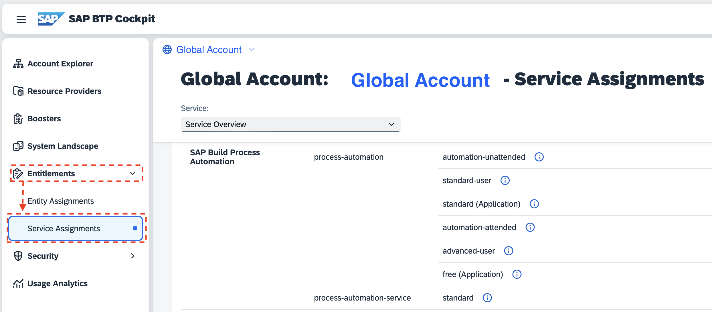
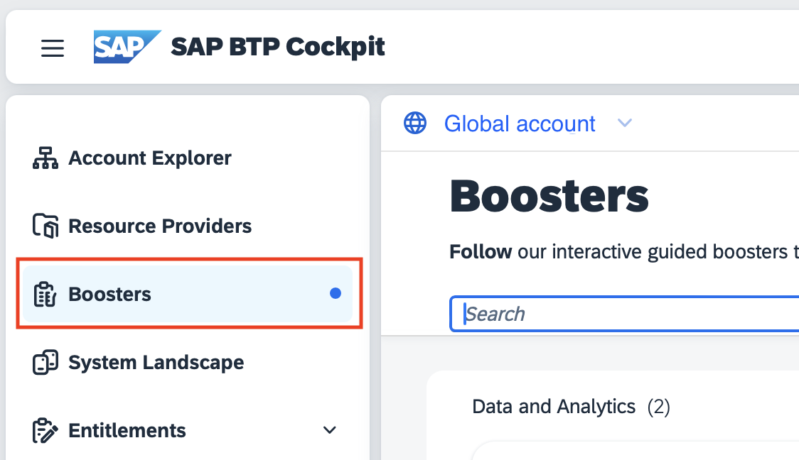
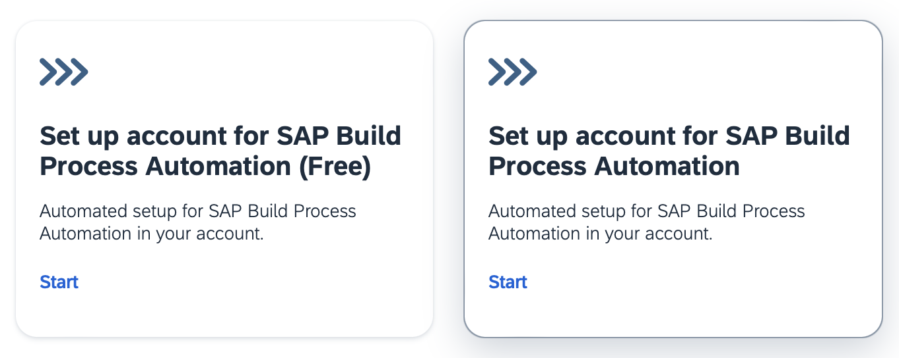
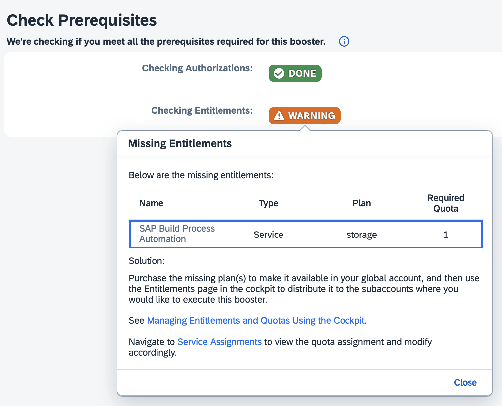
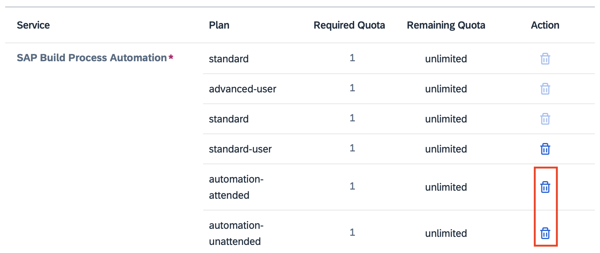

# 为 SAP 构建流程自动化设置子账号

---

## 1. 验证权限

要使用 _SAP 构建流程自动化_，您的全局账号必须拥有某些服务计划。

从您的 _全局账号_ 中，进入 _权限_ -> _服务分配_。

滚动到底部找到 _SAP 构建流程自动化_。

- **标准 (应用)**：这是订阅服务，用于访问 _SAP 构建大厅_。
- **高级用户**：可以设计、监控或管理该解决方案。
- **标准用户**：作为流程参与者，可以触发、审批或参与流程实例。
- **标准**（_流程自动化服务_）：可与标准（应用）权限结合使用，创建服务实例。

以下权限是可选的，本场景中不需要：

- **存储**：如果需要可增加存储配额。
- **API调用**：如果需要可增加API调用配额。
- **自动化（有人值守）**：允许使用自动化（机器人）在有人值守模式下运行，即用户需在本地安装代理。
- **自动化（无人值守）**：允许使用自动化（机器人）在无人值守模式下运行，即机器人在后台运行。

> 如果您想尝试使用 _免费 tier_ 运行 _SAP 构建流程自动化_，相关权限如下：
> 
> - **免费 (应用)**：这是订阅服务，用于访问 _SAP 构建大厅_。
> - **标准**（_流程自动化服务_）：可与免费（应用）权限结合使用，创建服务实例。
> 

## 2. 运行 Booster

通过使用 _Booster_，您可以配置 _SAP 构建流程自动化_ 到新的或现有的子账号中。

从您的 _全局账号_ 中，进入 _Booster_：

搜索 `build process` 以过滤结果。

以下链接是此流程的官方文档，我们建议您在运行 Booster 时与本页面一起阅读：

- [为 SAP 构建流程自动化设置账号](https://help.sap.com/docs/build-process-automation/sap-build-process-automation/subscribe-to-sap-build-process-automation-standard-plan?locale=en-US)：用于使用标准计划
- [为 SAP 构建流程自动化设置账号（免费版）](https://help.sap.com/docs/build-process-automation/sap-build-process-automation/get-free-access-to-sap-build-process-automation?locale=en-US)：用于使用 _免费版_

### Booster 步骤

向导将引导您完成以下步骤：

1. 验证您是全局账号或目录管理员，并验证权限可用

    > [!WARNING]
    > 您可以忽略可选权限的警告（_存储_、_API调用_、_自动化（有人值守）_、_自动化（无人值守）_）
    > 
    > 
    
2. 选择一个新子账号或现有子账号
3. 确认权限列表并选择子账号或提供新的子账号详情

    > [!TIP]
    > 在此阶段，您可以移除任何可选权限（_存储_、_API调用_、_自动化（有人值守）_、_自动化（无人值守）_）。您可以在之后任何需要时手动添加它们，以满足项目需求。
    > 
    >
   
4. 选择平台和业务用户的标识提供者，并添加他们以分配管理员（访问子账号）和开发者（访问 _SAP 构建大厅_）

    - _平台用户自定义标识提供者_：如有疑问，请选择您用于登录 _SAP BTP 控制台_ 的标识提供者来运行此 Booster。
    - _应用自定义标识提供者_：选择您的用户（开发者和流程参与者）存在的标识提供者。
    - _管理员_：添加应具有子账号访问权限的用户。
    - _开发者_：添加应具有 _SAP 构建大厅_ 访问权限的用户。

    > [!TIP]
    > - 您稍后可以从子账号的 _安全 -> 信任配置_ 中更改此配置。
    > - 您的用户将自动作为管理员和开发者添加。
    > - 您可以在任何时间从子账号的 _安全 -> 用户_ 中添加或移除用户。
5. 审查并启动流程。

等待其完成。如果没有问题：

> [!TIP|icon:fa-solid fa-check|label:恭喜]
> 您已成功配置 _SAP 构建流程自动化_。继续配置商业伙伴场景的需求。