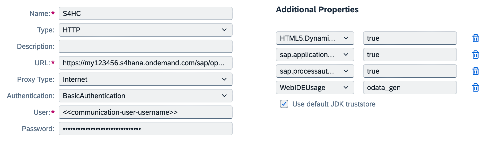
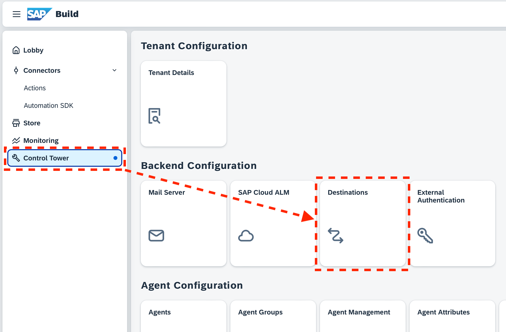
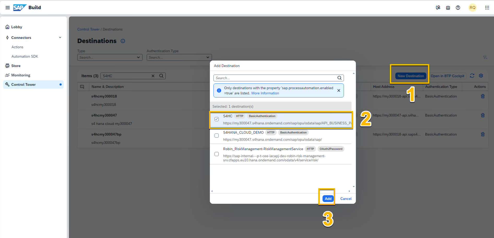
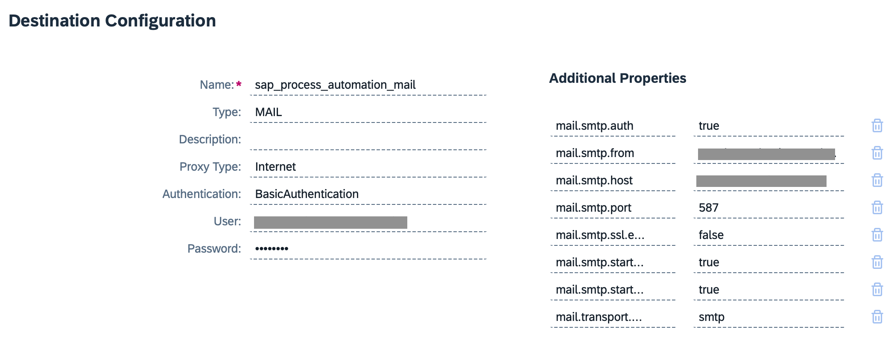

# Requirements for Business Partner scenario

<!-- - SAP Build Process Automation subscription ([instructions here](https://help.sap.com/docs/build-process-automation/sap-build-process-automation/subscribe-to-sap-build-process-automation-standard-plan)) -->

Before starting, make sure your user has [developer or admin permission](https://help.sap.com/docs/build-process-automation/sap-build-process-automation/authorizations) for SAP Build Process Automation, and is an administrator in the subaccount.

## 1. Destination for S/4 backend

To prepare the S4 system for the scenario: (***Optional***)

- Set up the communication arrangement **SAP_COM_0008** in the S/4 system 
    - [S/4HANA Cloud API docs](https://help.sap.com/docs/SAP_S4HANA_CLOUD/3c916ef10fc240c9afc594b346ffaf77/85043858ea0f9244e10000000a4450e5.html)
    - [S/4HANA API docs](https://help.sap.com/docs/SAP_S4HANA_ON-PREMISE/44e06f22436c43e582db6ccd5250e29b/85043858ea0f9244e10000000a4450e5.html)
- If using S/4HANA private cloud or on-prem,  SAP Cloud Connector must be installed and configured in SAP BTP ([SAP Cloud Connector docs](https://help.sap.com/docs/connectivity/sap-btp-connectivity-cf/cloud-connector))

### Create a destination in SAP BTP:

- URL must include `/sap/opu/odata/sap`
- Must have the following additional properties:
    - `sap.applicationdevelopment.actions.enabled`: `true`
    - `sap.processautomation.enabled`: `true`
- Use the communication user created in S4
- The name will be used to identify this destination

> Download a sample destination for S/4HANA Cloud  [S4HC](vx_attachments/154271525142569/S4HC ':target=_self') :truck::truck::truck:.

### Add destination to SAP Build

From _SAP Build Lobby_, go to _Settings_ > _Destinations_.

Add the destination you just created.

## 2. Destination to enable emails (optional)

Follow [SMTP destination for SAP Process Automation](https://help.sap.com/docs/build-process-automation/sap-build-process-automation/configuring-smtp-mail-destination) (to be able to send mails from the business process).

Download a sample destination [here](pages/01-requirements/files/sap_process_automation_mail.txt ':ignore :target=_self' ) :fa-solid fa-download:.
