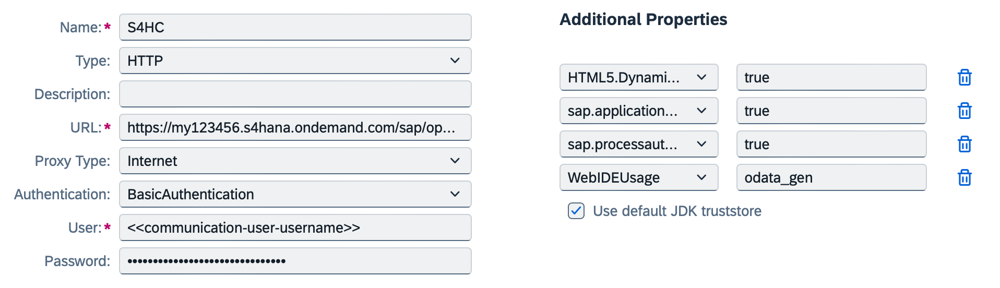
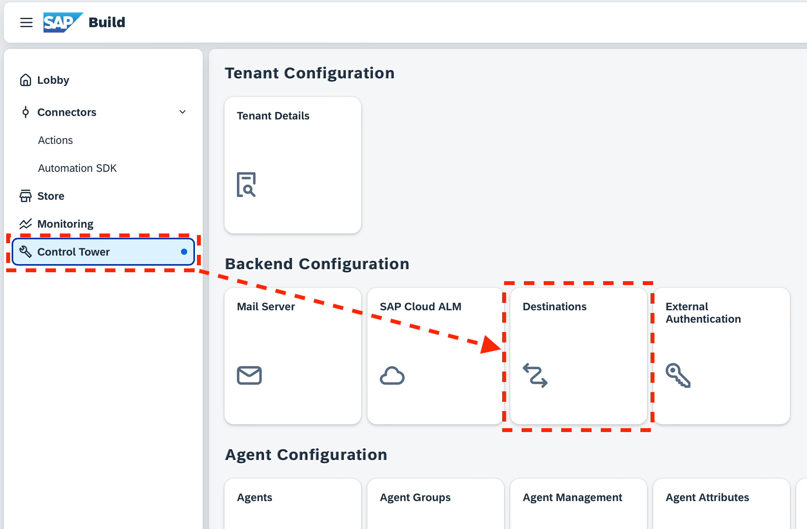
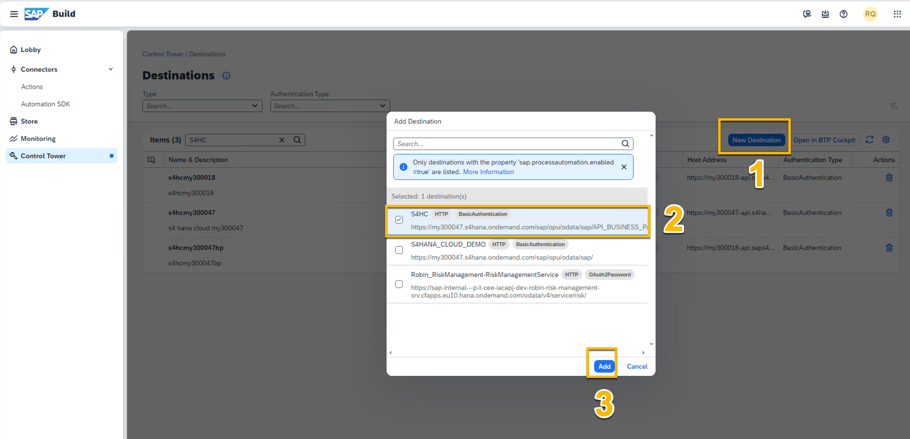
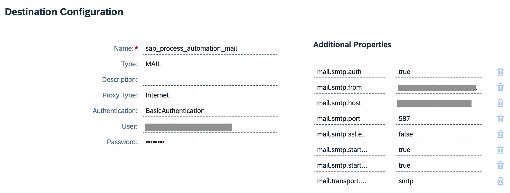

# 业务伙伴场景的要求

---

在开始之前，请确保你的用户拥有[SAP Build Process Automation的开发或管理员权限](https://help.sap.com/docs/build-process-automation/sap-build-process-automation/authorizations)，并且你是子账户的管理员。

## 1. S/4后端的目的地

为了为S4系统准备场景（可选）：

- 在S/4系统中设置通信安排**SAP_COM_0008**
    - [S/4HANA Cloud API文档](https://help.sap.com/docs/SAP_S4HANA_CLOUD/3c916ef10fc240c9afc594b346ffaf77/85043858ea0f9244e10000000a4450e5.html)
    - [S/4HANA API文档](https://help.sap.com/docs/SAP_S4HANA_ON-PREMISE/44e06f22436c43e582db6ccd5250e29b/85043858ea0f9244e10000000a4450e5.html)
- 如果使用S/4HANA私有云或本地部署，必须在SAP BTP中安装和配置SAP Cloud Connector（[SAP Cloud Connector文档](https://help.sap.com/docs/connectivity/sap-btp-connectivity-cf/cloud-connector)）

### 在SAP BTP中创建目的地：

- URL必须包含 `/sap/opu/odata/sap`
- 需要有以下附加属性：
    - `sap.applicationdevelopment.actions.enabled`: `true`
    - `sap.processautomation.enabled`: `true`
- 使用在S4中创建的通信用户
- 目的地名称将用于标识此目的地

> 下载S/4HANA Cloud的示例目的地[S4HC](https://robin-qiu.github.io/SAP-BTP-Process-Automation---Workflow---Bring-Your-Own-Tenant/vx_attachments/154271525142569/S4HC):truck::truck::truck:。
> 在工作坊期间会提供连接到S/4HANA Cloud的通信用户凭证，如果讲师忘记发送，请提醒他们。

### 将目的地添加到SAP Build

从**[SAP构建大厅](https://cnpcint-dev.eu10.build.cloud.sap/lobby)**，前往 **设置** > **目的地**

添加刚才创建的目的地

## 2. 发送电子邮件的目的地（可选）

遵循[SAP流程自动化SMTP目的地配置](https://help.sap.com/docs/build-process-automation/sap-build-process-automation/configuring-smtp-mail-destination)（以便能够从业务流程发送邮件）。

> 下载示例目的地[sap_process_automation_mail](https://robin-qiu.github.io/SAP-BTP-Process-Automation---Workflow---Bring-Your-Own-Tenant/vx_attachments/154271525142569/sap_process_automation_mail):truck::truck::truck:。
> 在工作坊期间会提供连接到测试邮件服务器的通信用户凭证，如果讲师忘记发送，请提醒他们。