<div class="draftWatermark"></div>

# 操作项目：商业伙伴 (A2X)

---

## 审查 API 规格

您可以在 [商业加速器中心](https://api.sap.com) 找到商业伙伴的 API：

- 对于 S/4HANA Cloud：https://api.sap.com/api/API_BUSINESS_PARTNER/overview
- 对于 S/4HANA 私有云或本地部署：https://api.sap.com/api/OP_API_BUSINESS_PARTNER_SRV/overview

## 创建操作项目

在本节中，我们将利用 SAP Build 智能向导来创建一个操作项目，以便在业务流程中使用商业伙伴 API。

从 [SAP Build 大厅](https://cnpcint-dev.eu10.build.cloud.sap/lobby)：

1. 创建一个新项目：

    
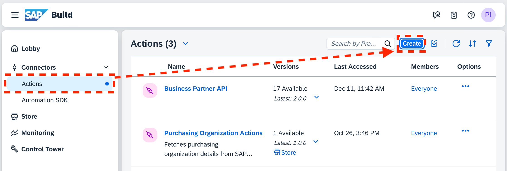


2. 选择 _商业加速器中心_：

    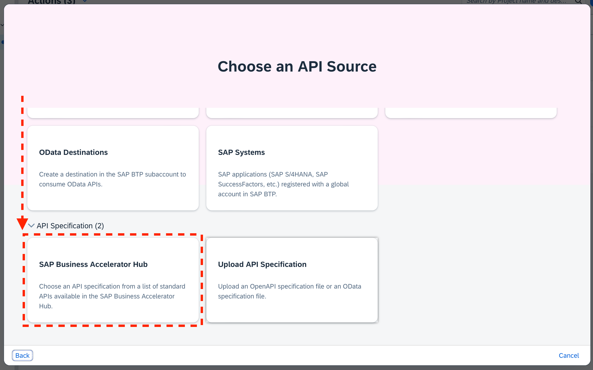

    > [!NOTE]
    > 您可以基于 [商业加速器中心](https://api.sap.com) 中可用的任何 API 创建操作项目。您也可以上传自己的 API 规格创建操作项目，详情请参阅支持的格式文档：[上传 API 规格](https://help.sap.com/docs/build-process-automation/sap-build-process-automation/uploading-api-specifications)

3. 点击 _显示筛选器_ 打开筛选器：

    
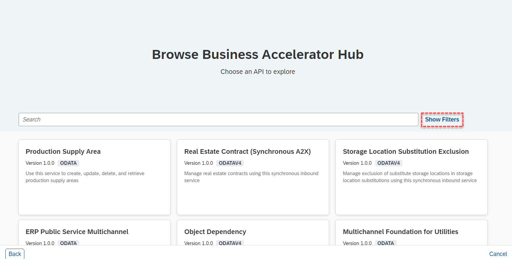


4. 输入 `Business Partner`。选择 SAP S/4HANA 的 API **商业伙伴 (A2X)**：

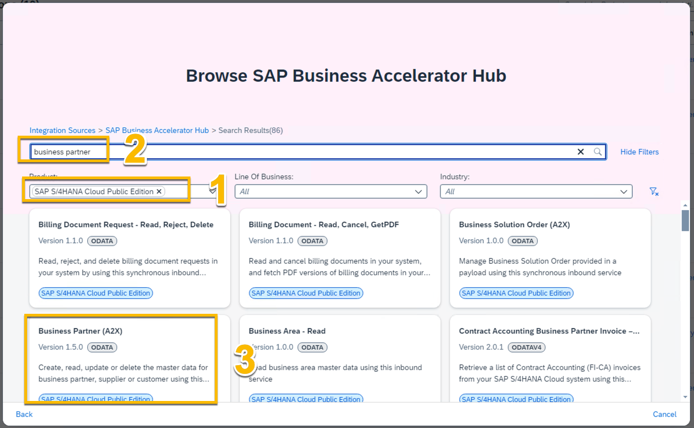

5. 当包加载完成后，点击 _下一步_：

   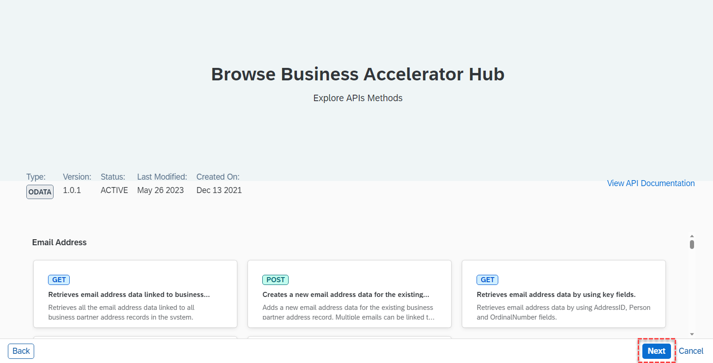
   

6. 最后，给项目命名（使用 `BP-API-${number}`）并点击 _创建_：

    ```
    BP-API-${number}
    ```

   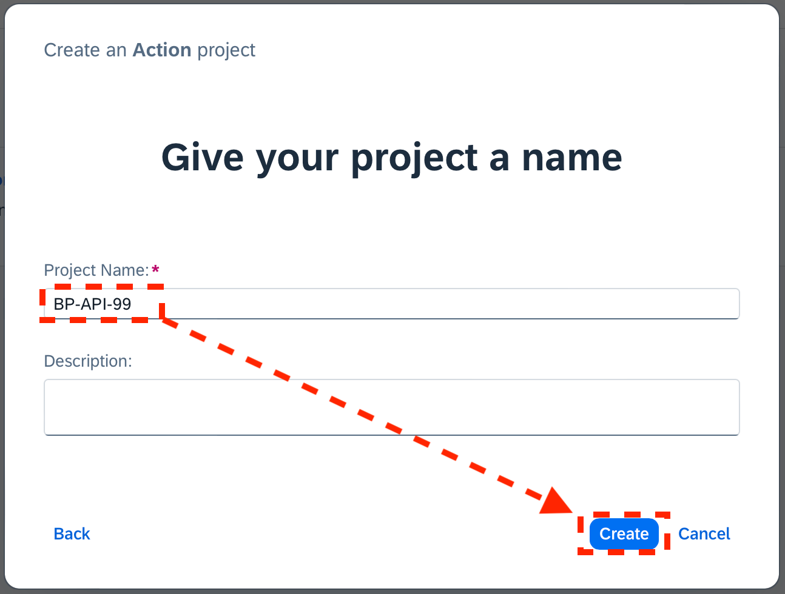
   

项目已创建。如果项目没有在新标签页中打开，请在大厅中出现后点击它以打开：

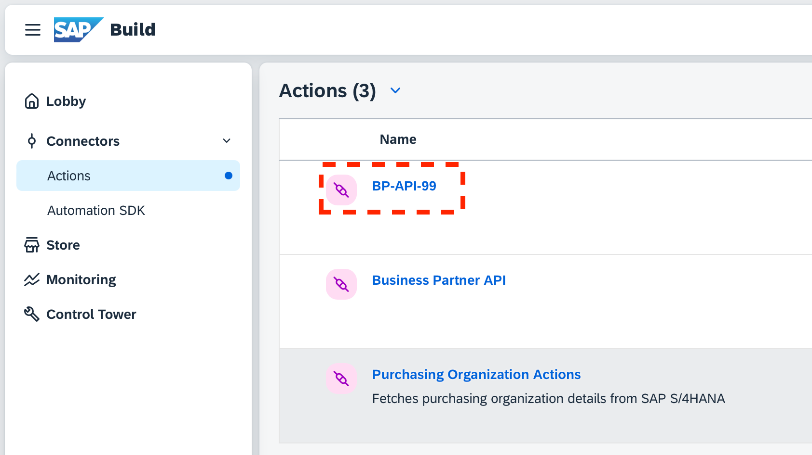

> [!TIP|icon:fa-solid fa-check|label:恭喜]
> 您已成功创建了商业伙伴 API 的操作项目。

## 选择 API 操作

操作编辑器是您可以配置要为业务流程提供服务的 API 的地方。首次打开时，您将看到以下屏幕：

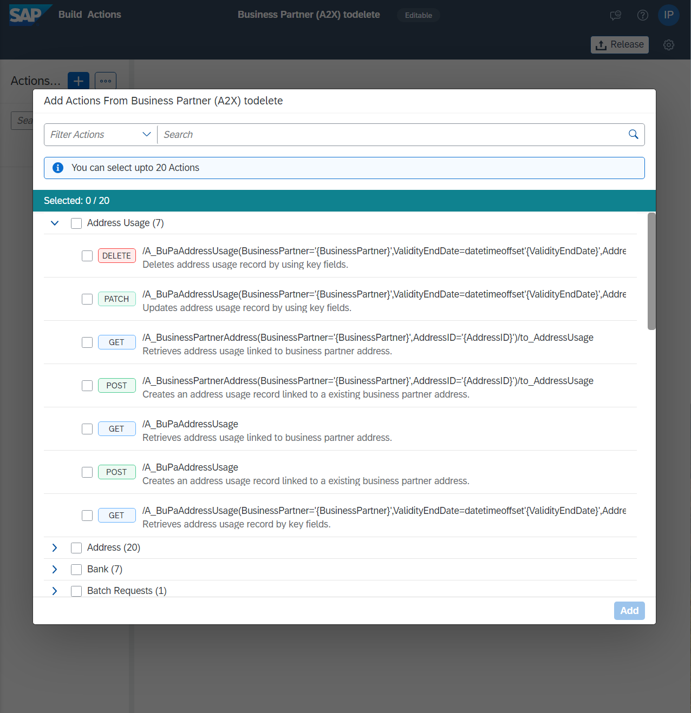


您需要选择要暴露在项目中的 API 操作。对于本次练习，我们需要：

- _商业伙伴_ > `POST /A_BusinessPartner`
- _商业伙伴_ > `GET /A_BusinessPartner('{BusinessPartner}')`
- _商业伙伴_ > `GET /A_BusinessPartner`

1. 从下拉菜单中选择操作并点击 _添加_：

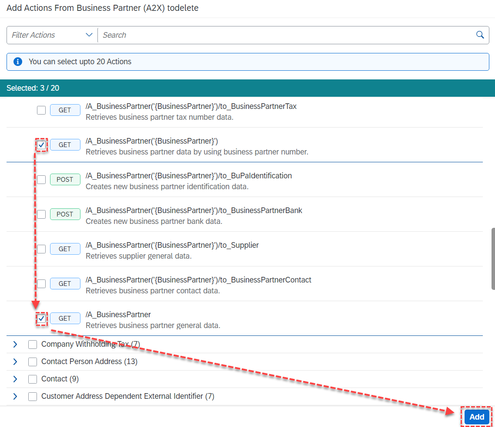


> [!TIP|icon:fa-solid fa-check|label:恭喜]
> 您已进入操作编辑器概览。请参考文档中的 [操作编辑器概述](https://help.sap.com/docs/build-process-automation/sap-build-process-automation/action-editor-overview) 了解更多详情。

## 配置 API 选项

现在我们来审查项目的通用设置：


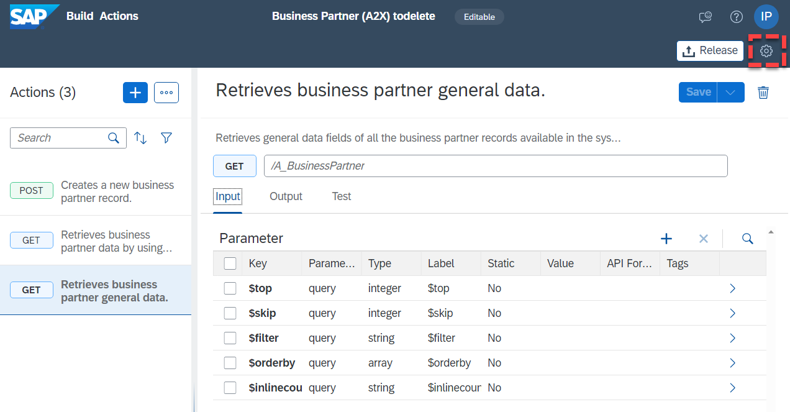


1. 启用 CSRF 令牌，并从设置菜单中配置端点：


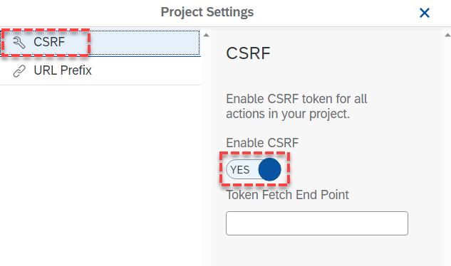

   > [!TIP]
   > CSRF 令牌是 POST 请求正常运行所必需的。这是 S/4HANA Cloud 的一项安全功能。更多信息请参阅 [此博客](https://blogs.sap.com/2019/11/08/s-4hana-cloud-x-csrf-token-and-e-tag-validation/) 和文档：[CSRF 令牌](https://help.sap.com/docs/build-process-automation/sap-build-process-automation/csrf-token)

2. 点击 _保存_。

3. 添加剩余路径：`/API_BUSINESS_PARTNER` 作为 URL 前缀。（S/4HANA Cloud 和 S/4HANA 私有云或本地部署都相同）

    ```
    /API_BUSINESS_PARTNER
    ```
    
    
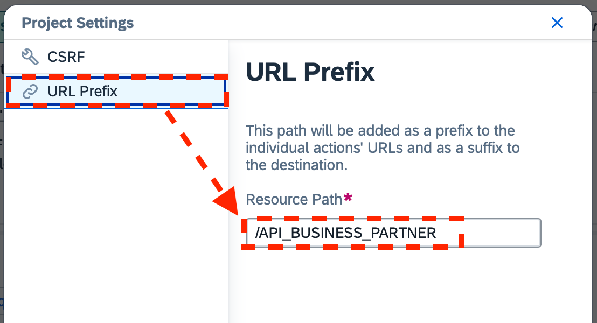

> [!INFO]
> 完整的 URL 将是目标 URL 加上前缀：  
> `https://my301964.s4hana.ondemand.com/sap/opu/odata/sap` + `/API_BUSINESS_PARTNER`

4. 再次保存更改。

> [!TIP|icon:fa-solid fa-check|label:恭喜]
> 您已设置正确的项目参数。

## 测试 GET API

让我们测试与 S/4 系统的连接。

1. 点击 GET 请求 _获取商业伙伴通用数据_，并转到 _测试_ 选项卡：

  
    
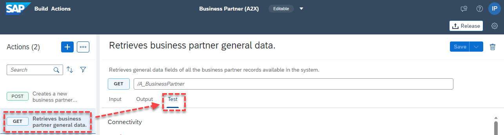

2. 选择 _目标_，并从下拉菜单中选择目标 `S4HC`。在 _$top_ 参数中输入 `1` 以避免获取过多记录。然后点击 _测试_：

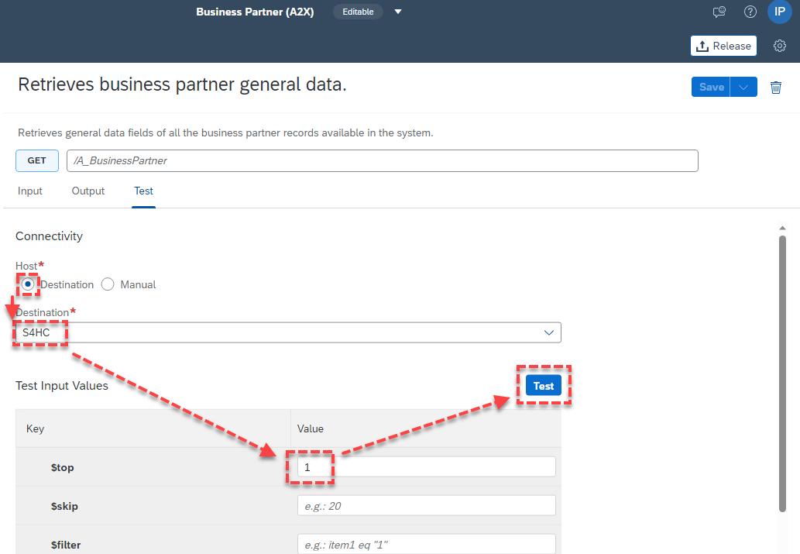

3. 您应该在底部看到商业伙伴出现，并看到状态为 `200:OK`：

    
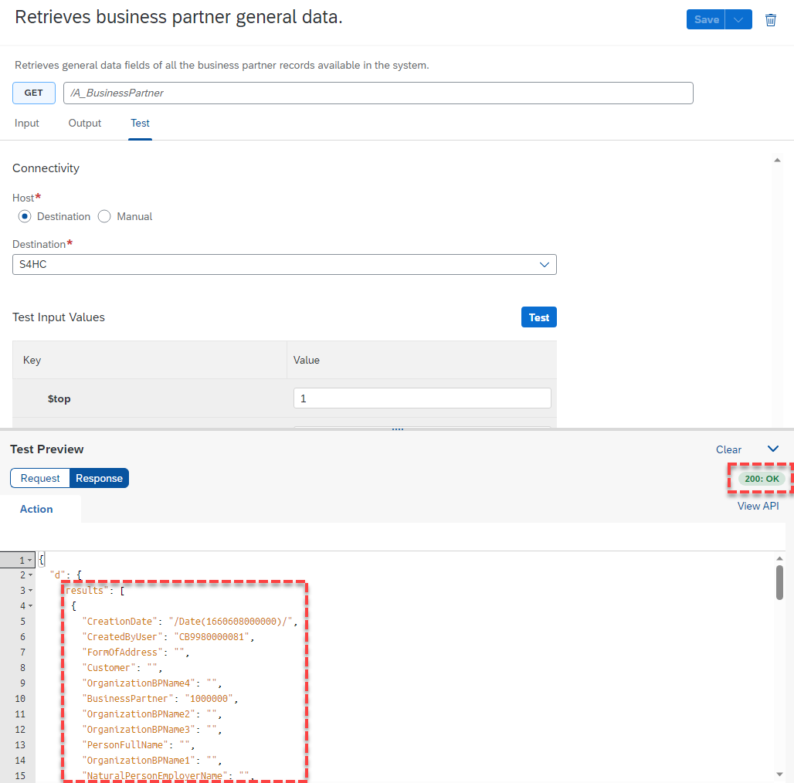


> [!TIP|icon:fa-solid fa-check|label:恭喜]
> 您已使用 SAP 构建流程自动化从 S/4 中获取数据。

## 配置 POST 操作

您可以将操作编辑器用作 API 中间件，移除不必要的字段，添加默认值，标记为必填字段等。这样做可以简化 API，仅暴露与业务流程相关的字段。

根据定义，商业伙伴实体较为复杂，包含大量字段和关系。在我们的用例中，您将移除大多数字段。

1. 点击 POST 请求 _创建新的商业伙伴记录_，并转到 _输入_ 选项卡

    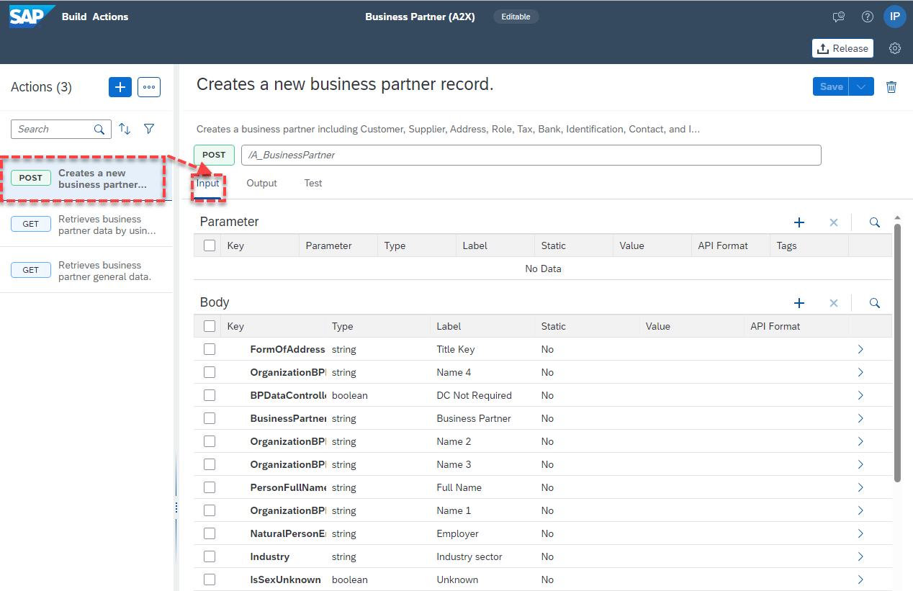

    > 您可以看到 API 接受的所有输入字段。在本次练习中，我们只使用以下字段：
    > - Initials
    > - LastName
    > - FirstName
    > - SearchTerm1
    > - SearchTerm2
    > - PersonFullName
    > - OrganizationBPName1
    > - BusinessPartnerCategory

2. 移除不需要的字段。为此，选择要移除的字段并点击 **移除** 按钮：

  
    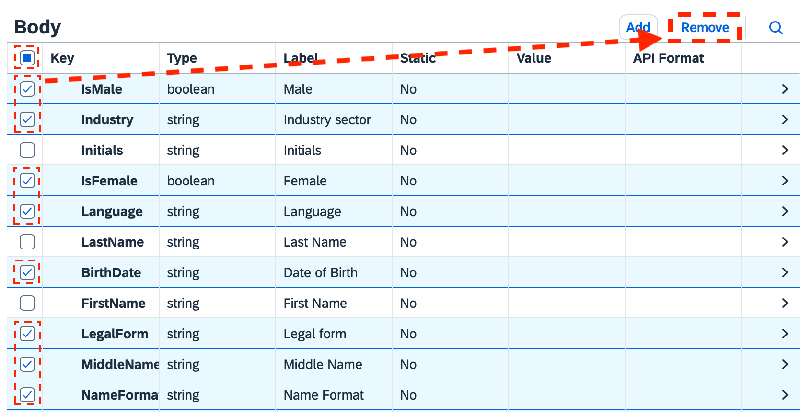
    
    

    结果应如下所示：
    
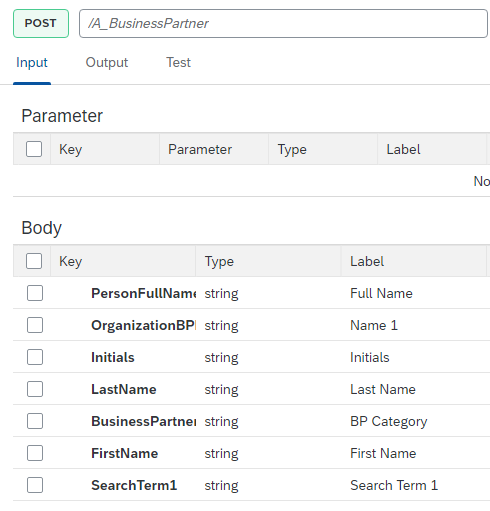


3. 现在我们来编辑部分字段：

    1. 点击以下字段使其为必填：

        > - 名字
        > - 姓氏
        > - 组织名称1
        > - 商业伙伴类别

  
        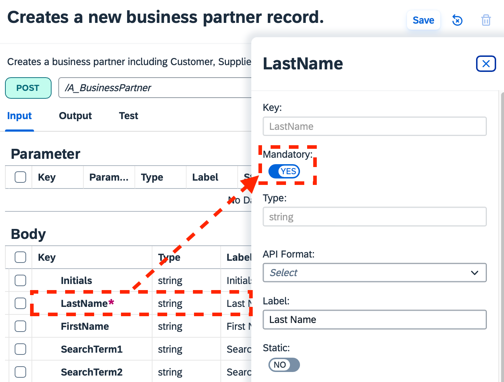
        

        > [!TIP]
        > 将字段设为必填将在使用 SAP 构建流程自动化调用操作时强制要求填写。

    
    2. 将字段 _搜索项2_ 设为静态，并设置值为：

    ```
    由SBPA生成
    ```

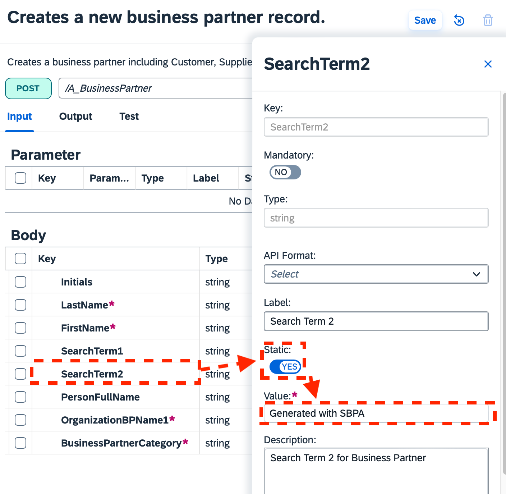

> [!TIP]
> 您可以设置固定值发送到后端。当在 SAP 构建流程自动化中使用该操作时，此字段将不会显示。

4. 转到 _输出_ 选项卡

    
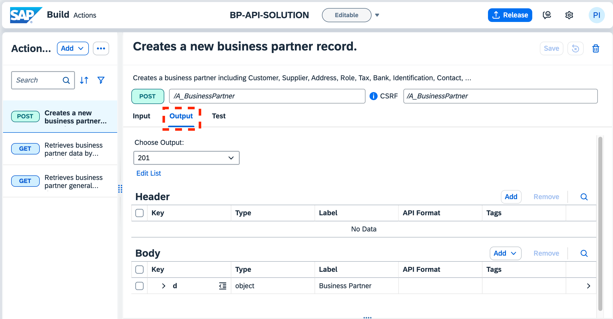


> 在 _内容_ 部分，打开下拉菜单 _d_。您可以看到 API 返回的所有字段。 
> 
    
   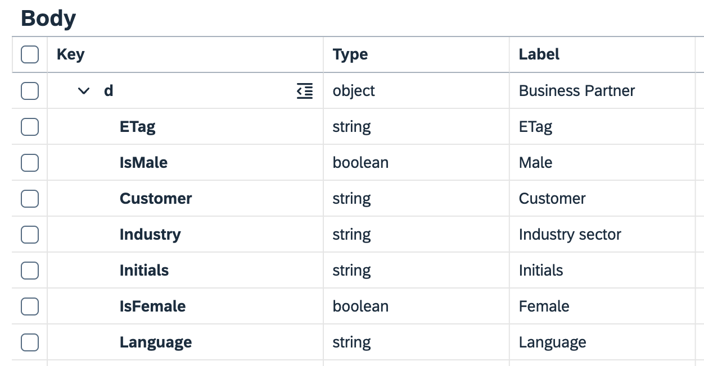
    

5. 我们只关心商业伙伴 ID 字段，该字段名为 _BusinessPartner_。移除所有不需要的字段。为此，选择所有字段，取消勾选 _BusinessPartner_，然后点击 **移除** 按钮：

 
    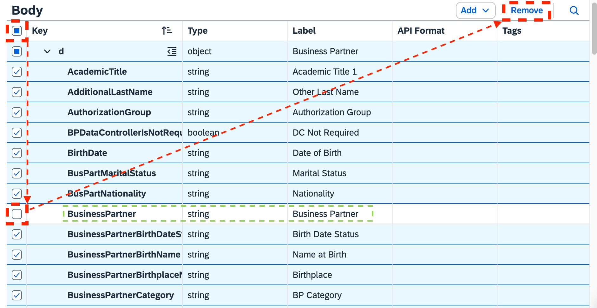
    

    结果应如下所示：

    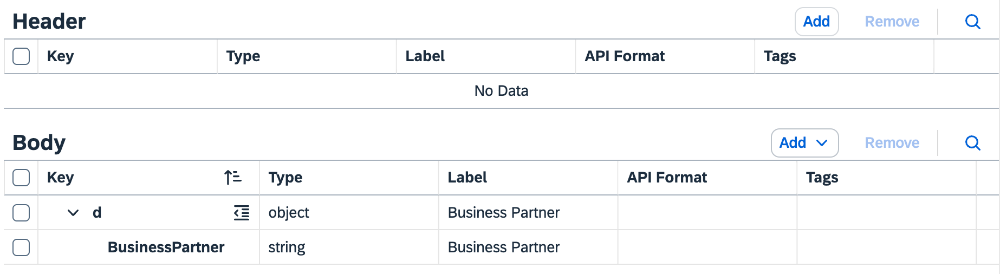

## 测试 POST API

让我们尝试创建一个商业伙伴以确认其是否正常工作。

1. 点击 POST 请求 _创建新的商业伙伴记录_，并转到 _测试_ 选项卡：

    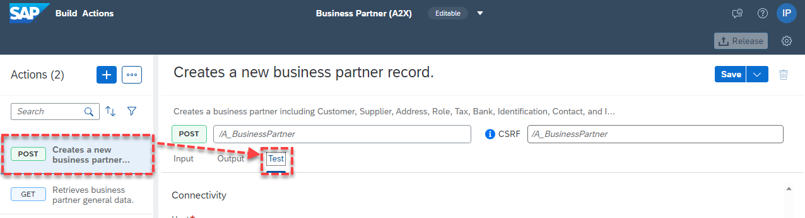
    

2. 选择 _目标_，并从下拉菜单中选择您的目标。填写商业伙伴详情。然后点击 _测试_：

    > [!NOTE]
    > `BusinessPartnerCategory` 必须是 `1`、`2` 或 `3`。

    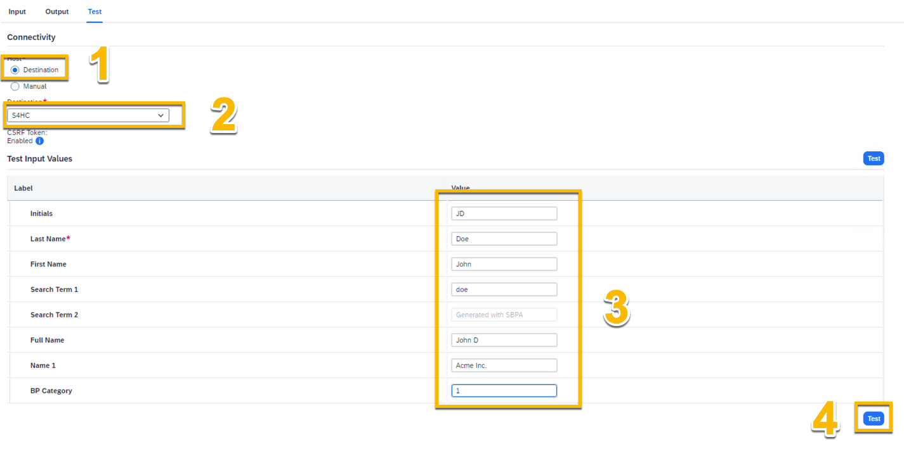

3. 您应该看到成功响应，状态为 `201:CREATED`，并看到新的商业伙伴出现在底部：


    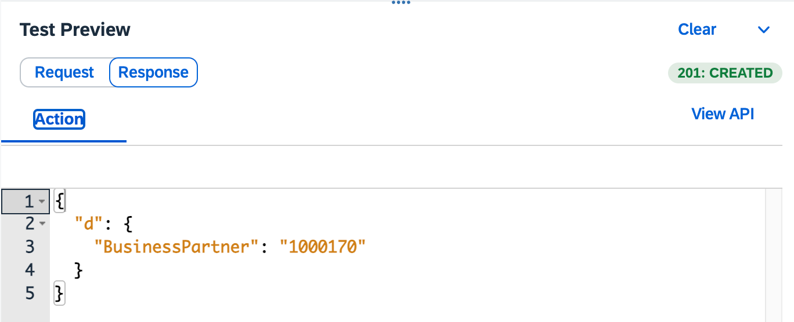
    

> [!NOTE|icon:fa-solid fa-camera|label:截图]
> 截取显示创建的商业伙伴和 201:Created 消息的屏幕截图。点击 <a href="mailto:sap_btp_adoption_workshop@sap.com?subject=BUILD02_WORKSHOP_DAY_1_COMPLETION_USER0${number}&body=Please make sure the subject looks ok, and attach the screenshot before sending.">此处</a> 创建新邮件。将截图发送至 `sap_btp_adoption_workshop@sap.com`，主题为 `BUILD02_WORKSHOP_DAY_1_COMPLETION_USER0${number}`。

> [!TIP|icon:fa-solid fa-check|label:恭喜]
> 您已使用 SAP 构建流程自动化在 S/4 中创建了商业伙伴。

## 保存、发布和发布操作项目

现在我们只需要让这些 API 调用在业务流程中可用。为此，我们需要发布并发布项目。

1. 点击 _保存_ 按钮保存项目：

    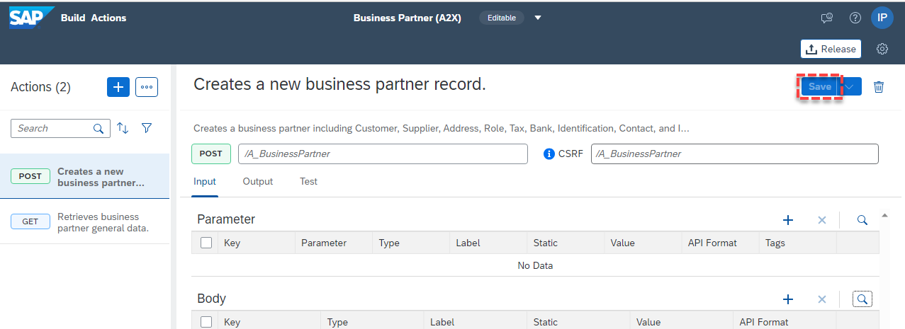
    

2. 然后您可以点击 _发布_。选择版本并再次点击 _发布_

  
    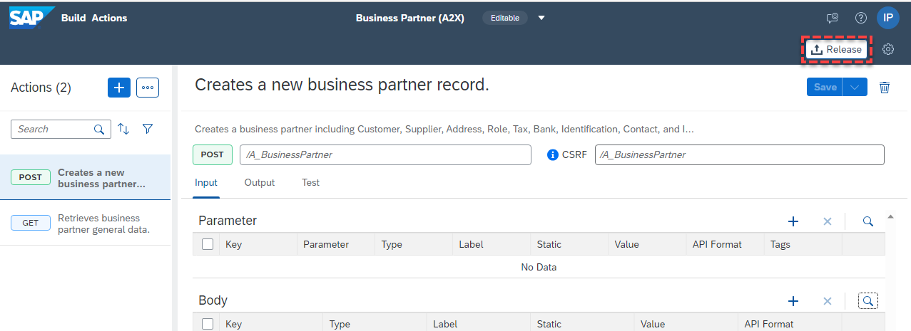
    

  
    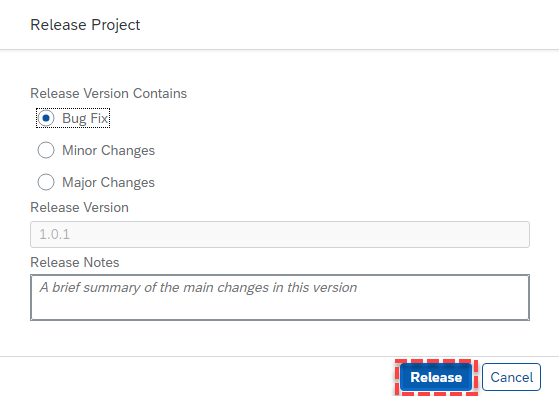
    

3. 最后，您可以 _发布到库_：

 
    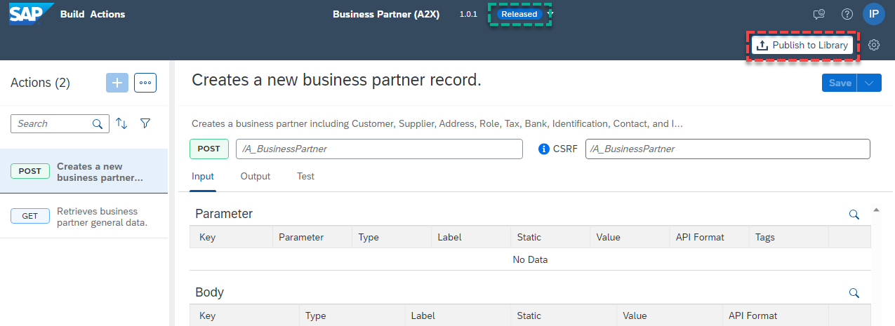

    > 注意，项目现在已标记为 _已发布_

4. 确认并点击 _发布_

    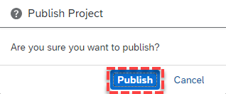

现在操作已发布：

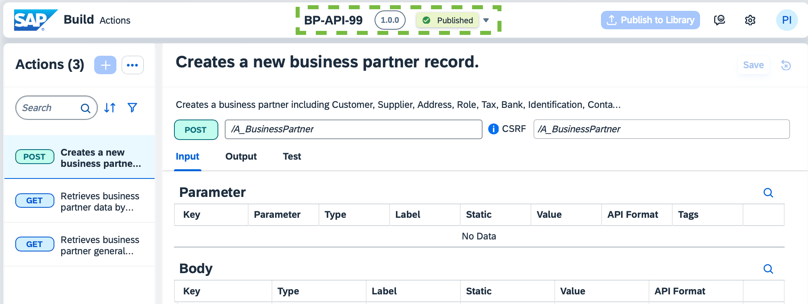

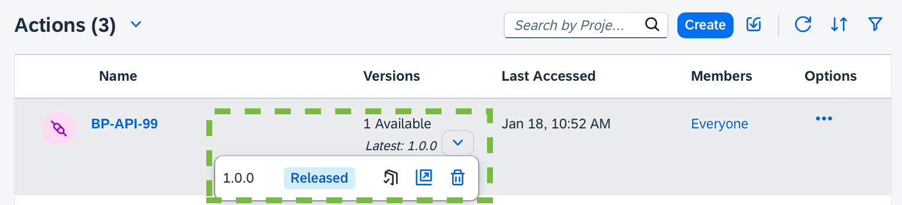


> [!TIP|icon:fa-solid fa-check|label:恭喜]
> 您已成功发布 API，可以在业务流程中使用。