# Action project: Business Partner (A2X)

## Review API specification

You can find the API for Business Partner in the [Business Accelerator Hub](https://api.sap.com):

- For S/4HANA Cloud: https://api.sap.com/api/API_BUSINESS_PARTNER/overview
- For S/4HANA Private Cloud or on-premise: https://api.sap.com/api/OP_API_BUSINESS_PARTNER_SRV/overview

## Create Action project

In this section, we will leverage SAP Build wizards to create an Action project that will allow us to use the Business Partner API froma business process.

From the [SAP Build Lobby](https://build02-worksop.eu10.build.cloud.sap/):

1. Create a new project:

    
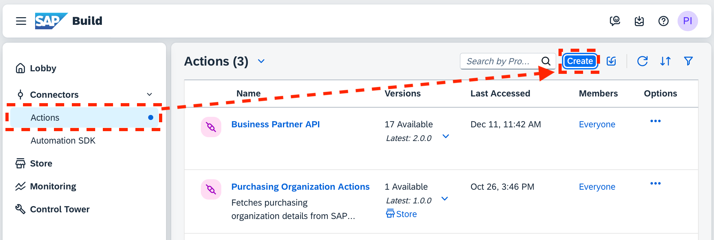


2. Select _Business Accelerator Hub_:

    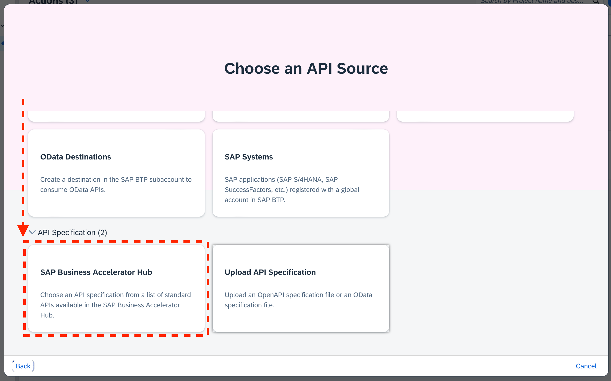

    > [!NOTE]
    > You can create an Action project based on any API that is available at the [Business Accelerator Hub](https://api.sap.com). You can also create an action project uploading your own API specification, see the documentation for supported formats: [Uploading API Specifications](https://help.sap.com/docs/build-process-automation/sap-build-process-automation/uploading-api-specifications)

3. Open the filters clicking in _Show Filters_:

    
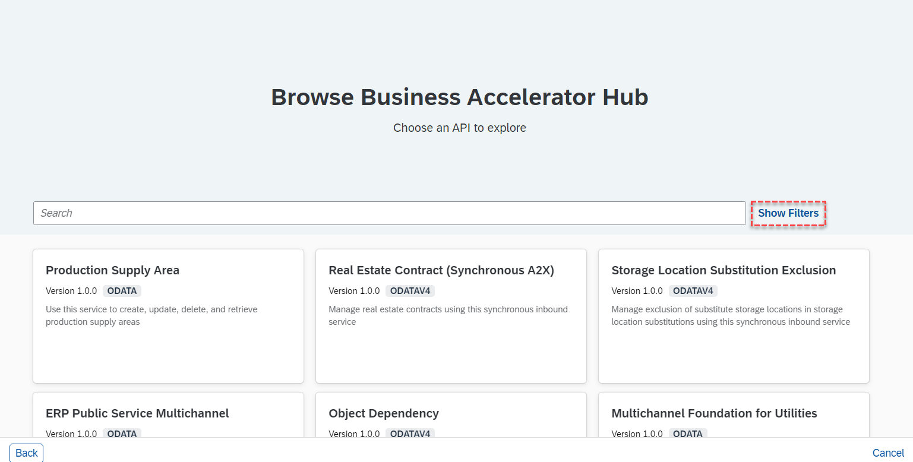


4. Type `Business Partner`. Select the API **Business Partner (A2X)** for _SAP S/4HANA_:


5. When the package loads, click _Next_:

   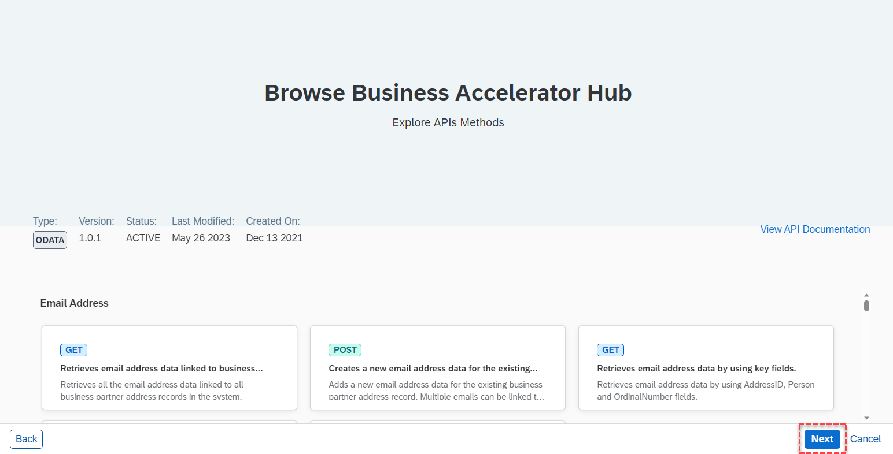
   

6. Finally, give the project a name (use `BP-API-${number}`) and click _Create_:

    ```
    BP-API-${number}
    ```

   
   

Your project will be created. If the project does not open in a new tab, click on it to open it once it appears in the lobby:


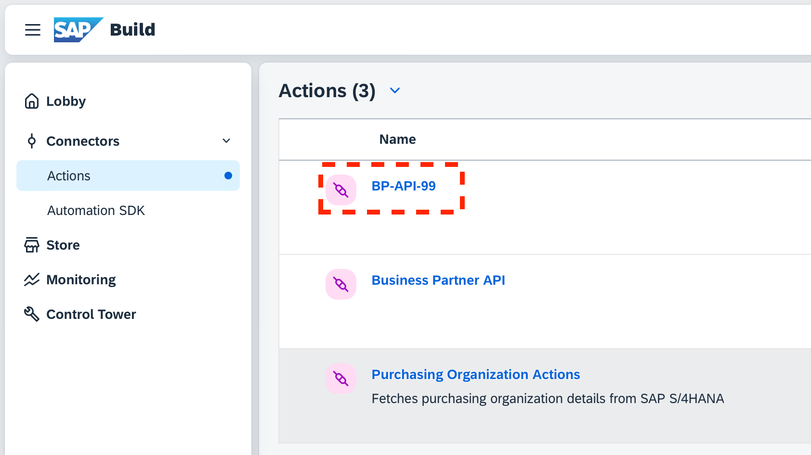

> [!TIP|icon:fa-solid fa-check|label:Congratulations]
> You have successfully create an Action project for the Business Partner API.

## Choosing API operations

The Actions Editor is where you can configure the API's you want to make available for the business processes. The first time you open it, you will be prompted with a screen:


You need to select the API operations you want to expose in your projects. For this exercise, we will need:

- _Business Partner_ > `POST /A_BusinessPartner`
- _Business Partner_ > `GET /A_BusinessPartner('{BusinessPartner}')`
- _Business Partner_ > `GET /A_BusinessPartner`

1. Select the Actions from the dropdown and click _Add_:


> [!TIP|icon:fa-solid fa-check|label:Congratulations]
> You have reached the Action Editor overview. Check [Overview of an Action Editor](https://help.sap.com/docs/build-process-automation/sap-build-process-automation/action-editor-overview) in the documentation to learn more.

## Configure the API options

Let's review now the general settings of the project:


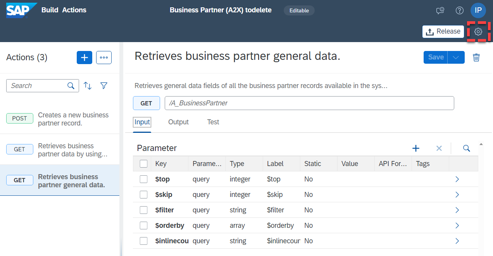


1. Enable CSRF token and configure the endpoint from the settings menu:


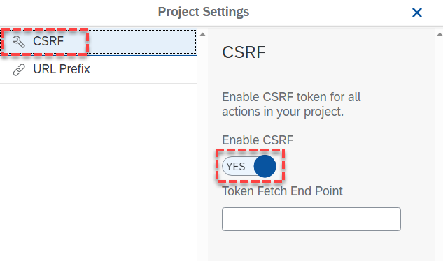

    > [!TIP]
    > The CSRF token is necessary for the POST call to work. This is a security feature of S/4HANA Cloud. See more in [this blog](https://blogs.sap.com/2019/11/08/s-4hana-cloud-x-csrf-token-and-e-tag-validation/) and in the docs: [CSRF Token](https://help.sap.com/docs/build-process-automation/sap-build-process-automation/csrf-token)

2. Click _Save_.

3. Add the remaining path: `/API_BUSINESS_PARTNER` as URL prefix. (This is the same for S/4HANA Cloud and S/4HANA Private Cloud or on-prem)

    ```
    /API_BUSINESS_PARTNER
    ```
    
    
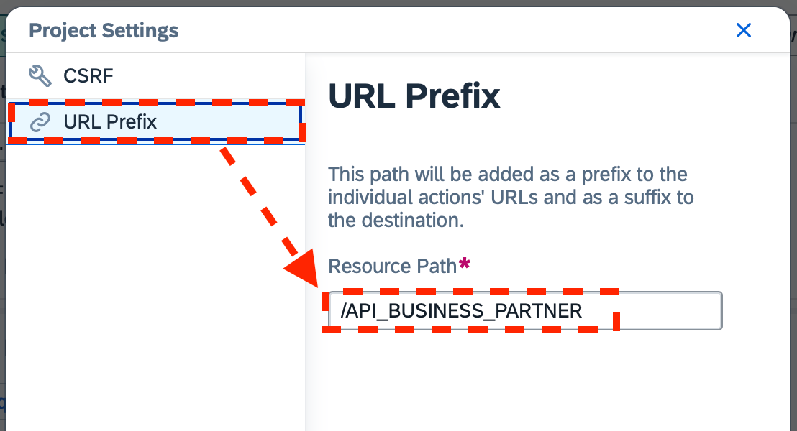

    > [!INFO]
    > The complete URL will be the destination URL + the prefix: 
    > `https://my301964.s4hana.ondemand.com/sap/opu/odata/sap` + `/API_BUSINESS_PARTNER`

4. Save the changes again.


> [!TIP|icon:fa-solid fa-check|label:Congratulations]
> You have set the right settings for the project.

## Test the GET API

Let's test the connectivity to the S/4 system.

1. Click on the GET call _Retrieves business partner general data_ and go to the tab _Test_:

  
    


2. Select _Destination_, and choose the destination `S4HC` from the dropdown. Type `1` in the _$top_ parameter to avoid retrieving too many records. Then click _Test_:

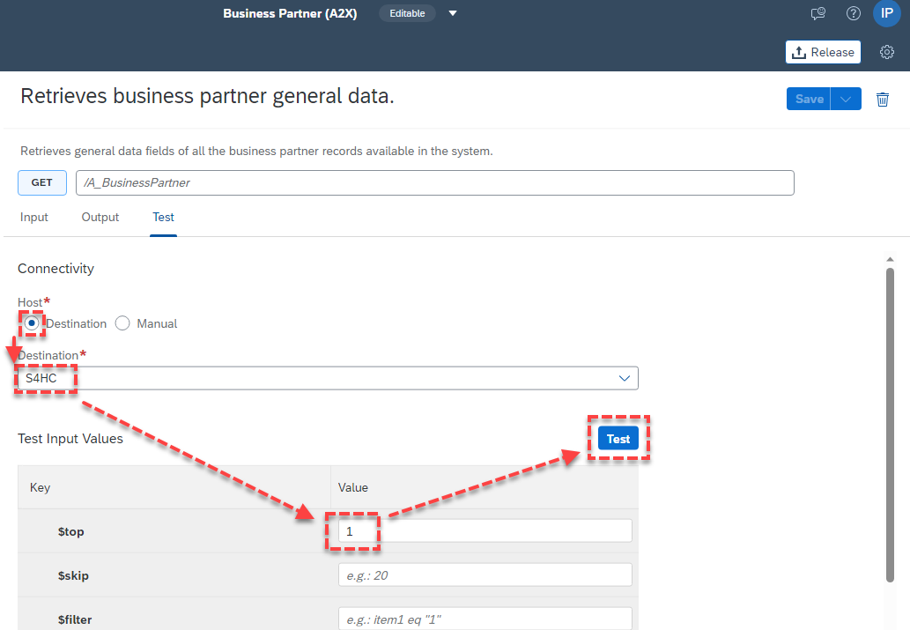

3. You should see a business partner appear at the bottom and see the status `200:OK`:

    
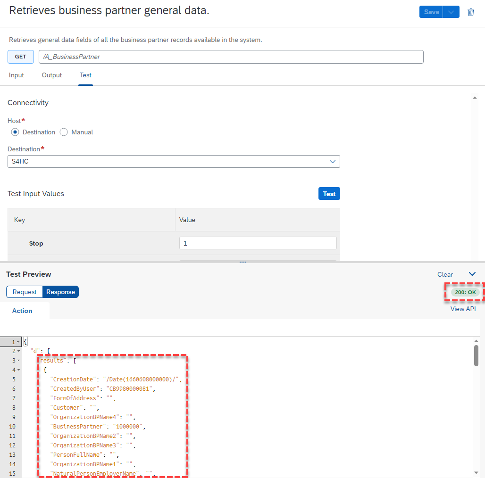


> [!TIP|icon:fa-solid fa-check|label:Congratulations]
> You have retrieved data from S/4 with SAP Build Process Automation.

## Configure the POST operation

You can use the Actions editor as an API middleware, and remove unnecessary fields, add default values, mark them as required... Doing this, you can simplify the API so that only relevant fields are exposed in the business process.

By definition, the Business Partner entity is complex and includes lots of fields and relations. For our usecase, you will remove most of the fields.

1. Click on the POST call _Creates a new business partner record_ and go to the tab _Input_

    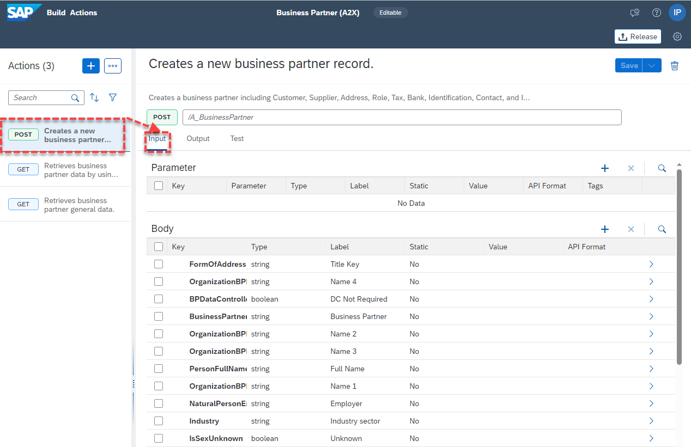

    > You can see all the fields the API accepts as input. For our exercise, we will only use the following fields:
    > - Initials
    > - LastName
    > - FirstName
    > - SearchTerm1
    > - SearchTerm2
    > - PersonFullName
    > - OrganizationBPName1
    > - BusinessPartnerCategory

2. Remove all fields that are not needed. For that, select the fields you want to remove and click the **Remove** button:

  
    
    
    

    The result should look like:
    
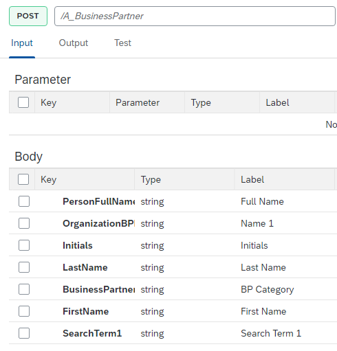


3. Now let's edit some of this fields:

    1. Click in the following fields to make them mandatory:
        
        > - FirstName
        > - LastName
        > - OrganizationBPName1
        > - BusinessPartnerCategory

  
        
        

        > [!TIP]
        > Making fields mandatory will make it mandatory to fill when we use the action in SAP Build Process Automation.

    
    2. Make the field _SearchTerm2_ static, and set the value to:

    ```
    Generated with SBPA
    ```

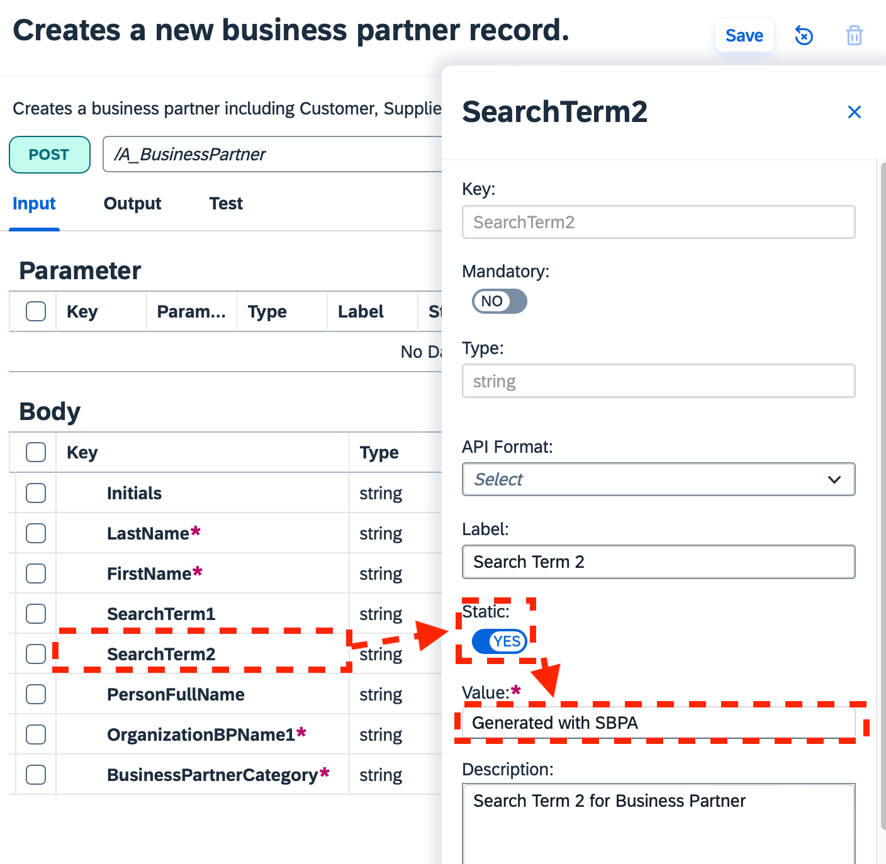

        > [!TIP]
        > You can set a fixed value to send to the backend. This field will not be shown when we use the action in SAP Build Process Automation.

4. Go to the tab _Output_

    


    > In the _Body_ section, open the dropdown _d_. You can see all fields that the API will give as a result. 
    > 
    
   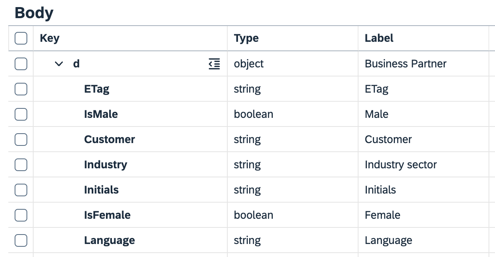
    

5. We are only interested in the business partner ID field, which is called _BusinessPartner_. Remove all fields that are not needed. For that, select all fields, uncheck _BusinessPartner_ and click the **Remove** button:

 
    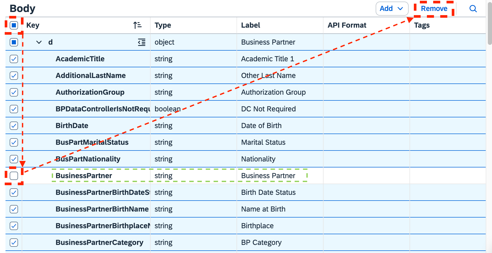
    

    The result should look like:

    

## Test the POST API

Let's try to create a Business Partner to confirm it is working.

1. Click on the POST call _Creates a new business partner record_ and go to the tab _Test_:

    
    

2. Select _Destination_, and choose your destination from the dropdown. Fill the Business Partner details. Then click _Test_:

    > [!NOTE]
    > `BusinessPartnerCategory` must be either `1`, `2` or `3`.

    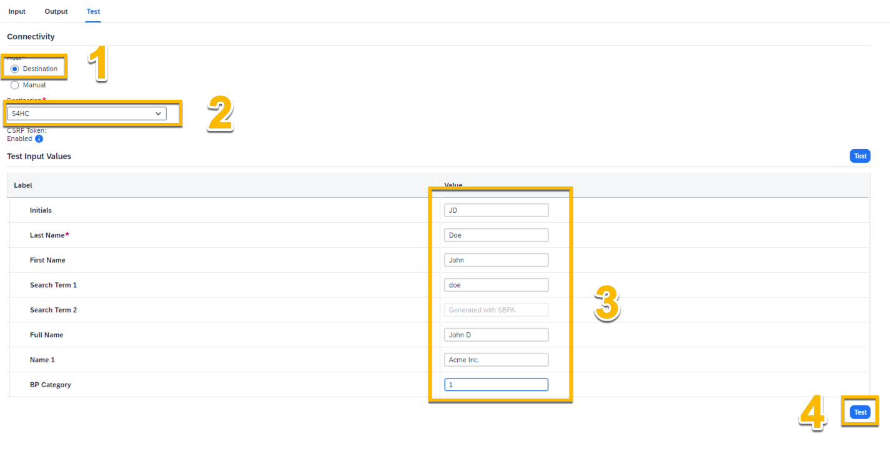

3. You should see a successful response with status `201:CREATED` and a new business partner appear at the bottom:


    
    

> [!NOTE|icon:fa-solid fa-camera|label:Screenshot]
> Take a screenshot of the screen showing the business partner created and the 201:Created message. Click <a href="mailto:sap_btp_adoption_workshop@sap.com?subject=BUILD02_WORKSHOP_DAY_1_COMPLETION_USER0${number}&body=Please make sure the subject looks ok, and attach the screenshot before sending.">here</a> to create a new email. Send the screenshot to `sap_btp_adoption_workshop@sap.com`, including `BUILD02_WORKSHOP_DAY_1_COMPLETION_USER0${number}` as the subject.

> [!TIP|icon:fa-solid fa-check|label:Congratulations]
> You have created a business partner in S/4 with SAP Build Process Automation.

## Save, release and publish the action project

Now we just need to make this API calls available from the business processes. For this, we need to release and publish the project.


1. Save the project with the _Save_ button:

    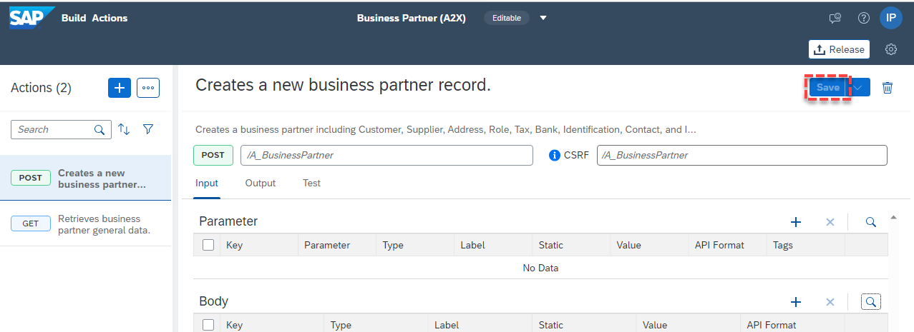
    

2. Then you can click _Release_. Choose the version and click again on _Release

  
    
    

  
    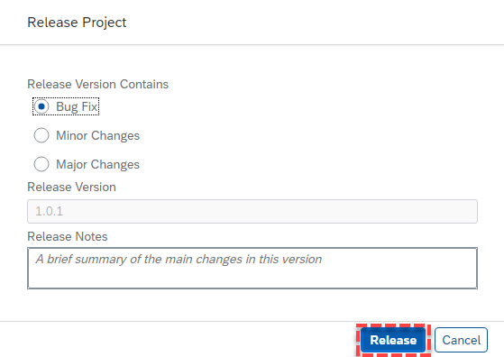
    

3. Finally, you can _Publish to Library_:

 
    

    > Note that the project is now tagged with _Released_

4. Confirm and click _Publish_

    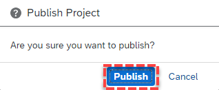

Now the Actions is published:

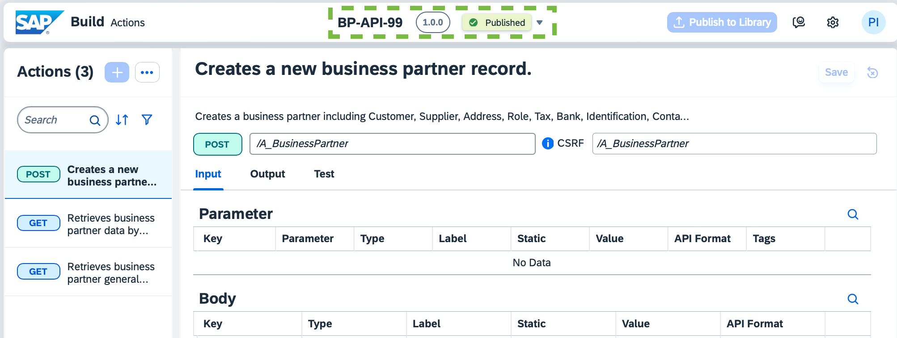


> [!TIP|icon:fa-solid fa-check|label:Congratulations]
> You have published the API and can use it from your business processes.