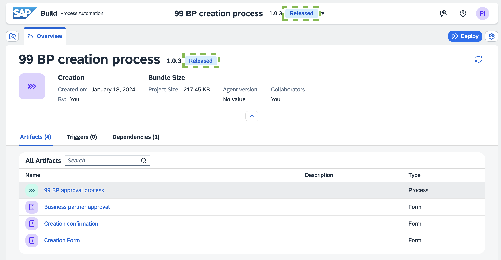
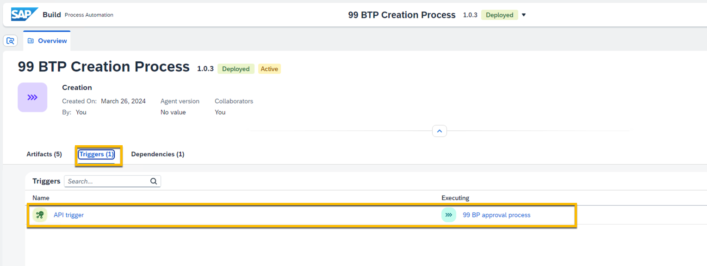
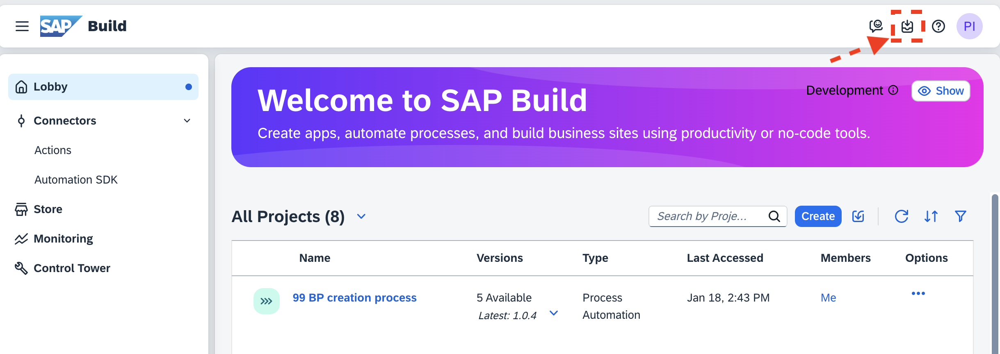

<div class="draftWatermark"></div>


# Set up an API trigger


---

In the previous exercise, we have built and deployed a business process. To trigger this process we used a form. This is fine for simple scenarios where end users are expected to provide the information. Many other times, you will want to trigger the process from another application (Build Apps, Fiori, or another application). To do this, you can use an [API trigger](https://help.sap.com/docs/build-process-automation/80e3d1a6e74844548a7d168fd1f95a98/configure-and-test-api-call-to-trigger-process).

## Go back to _Editable_ version

1. Open your business process project `${number} BTP creation process`


2. Open the _Editable_ version:

   
    

## Create a Data Type

[Data types](https://help.sap.com/docs/build-process-automation/80e3d1a6e74844548a7d168fd1f95a98/create-data-type-process-automation) make it easy to manage a group of fields. In our case, we can group the business partner fields (firstName, lastName, email...) into a _business partner_ data type.

You will configure the process to expect all these fields when it is triggered via API.

1. From the overview of the project, create a new _Data Type_:

  
    

2. Give the following name and click _Create_:

    ```
    Business Partner
    ```

    

3. Download the data type excel template: [BPDataType.xlsx](https://robin-qiu.github.io/SAP-BTP-Process-Automation---Workflow---Bring-Your-Own-Tenant/vx_attachments/154271525142569/BPDataType.xlsx ':include')  :truck::truck::truck:. 
Click on _Import Excel File_:

 
    

    > [!INFO]
    > You can also add fields manually, but importing an Excel makes things faster

4. Select the file you just downloaded and click _Import an Excel file_:

    

5. The fields will populate. It should look like this:

  
    

    > [!INFO]
    > To define a data type, you have to add the fields it will contain, and define the type (string, number...) and some properties (if it is a list of values, if it is required).

6. Save the progress

> [!TIP|icon:fa-solid fa-check|label:Congratulations]
> You have successfully created a data type. 

## Change the trigger

1. Open the main process project `${number} BTP approval process`

2. Click on the three dots of the trigger form, and click _Remove_:

 
    

3. Now add a new API trigger:

    

4. Give it a name and click _Create_:

    ```
    API trigger
    ```

    

5. The new API trigger will look like this:

 

> [!TIP|icon:fa-solid fa-check|label:Congratulations]
> You have successfully configured an API trigger for your project. 

## Configure the input fields of the process

When using a form as a trigger, users were asked to enter the relevant fields. To do the same thing with an API trigger, we need to define the inputs of the process.

1. Click anywhere in the gray space to see _Process Details_ on the right side. Click on _Variables_. Next to _Process Inputs_, click _Configure_:

  
    

2. Click _Add input_, give it the name below. In _Type_ select _Business Partner_ (at the bottom of the list). Mark it as required. Click _Apply_.

    ```
    Business Partner input
    ```

    

3. Save the progress

> [!TIP|icon:fa-solid fa-check|label:Congratulations]
> You have successfully configured input parameters in the process. 

## Map the new fields in the rest of the process

When you deleted the _Creation form_ trigger, all the mappings to fields in the approval, action and mail steps disappeared. Configure the mappings using the new fields available from the process inputs.

1. Map fields in the **approval form**

    - In the tab _General_: Add the organization name at the end of the _Subject_ field:

 
    

    - In the tab _Inputs_: Map all the fields

    


2. Map fields in the **action**

    - In the tab _Inputs_: Map all the fields

    

3. Map fields in the **mail**

    - Click _Open Mail Editor_: Add first and last name at the salutation:

   
    

4. Save the project.

## Release and deploy the project

1. Click on the _Release_ button that is above the _Save_ button.

   
    

2. Because this is the first release, there is no need to change the version number. You can click _Release_:

   
    

    After the release, you can notice how the version number and the _Released_ tag appeared.

  

    This version of the project is now read only.

3. To deploy, click on the _Deploy_ button:

    
    
    

    This is a 3 step process:

    1. Review artifacts being deployed, click _Next_:

    

    2. Assign values to variables. Here is where you will assign the actual destination (the destination name might be different ion your case):

  


    3. Review the triggers. Now you can see the API trigger you have created here. Click _Deploy_:

  

    The project will be deployed. When it finishes, you will see the tag _Deployed_:

  

> [!TIP|icon:fa-solid fa-check|label:Congratulations]
> You have successfully deployed the project.

## Set up SAP Business Accelerator Hub for API Test

Now the project is ready and listening for API requests. Let's leverate SAP Business Accelerator Hub to trigger API request.

1. Open [SAP Business Accelerator Hub](https://api.sap.com/) and login with your BTP account. Then click **SAP Business Technology Platform** tile to browse the BTP APIs:

    
2. Open **APIs** tab and search for ***"workflow"***, then click **SAP Build Process Automation** tile to find the workflow APIs:


3. On **REST API** tab, click **Workflow** tile and open the API specification.


4. On **API Reference** tab, open **Workflow Instances** menu to check the APIs.


## Set up the API Test environment

You can use a free desktop program like Postman or Insomnia to send an API request. 
In this exercise, you will leverage SAP Business Accelerator Hub to test the API.

Firstly, you need to set up the environment for your licensed product to test APIs using your data.

1. Click the **Try Out** tab, then choose **Select Environment** to  **Add New Environment**.


2. Enter the **Display Name** and select the **Starting URL** referring to your subaccount API Endpoint.


3. Enter the OAuth2.0 configuration under **Authentication** section and you can find the *Client ID*, *Client Secret* and *Token URL* from the key of SAP Build Process Automation instance. As the **Consumersubdomainame** filed, you can refer the **identityzone** from the instance key.
> [!INFO]
> More information on how to get the OAuth2.0 Client Credential details in the documentation: [Determine service configuration parameters - SAP Build Process Automation](https://help.sap.com/docs/build-process-automation/80e3d1a6e74844548a7d168fd1f95a98/determine-service-configuration-parameters)


## Test the API Trigger


1. Go back **Try Out** tab, choose your test environment and select the API */v1/workflow-instances* under the **Worflow Instances** menu.

Paste the request body as below:
```
{
    "definitionId": "<<Get it from the Monitoring page>>",
    "context": {
        "businessPartnerInput": {
            "firstName": "John",
            "lastName": "Doe",
            "email": "johndoe@example.com",
            "category": "1",
            "organization": "Acme Inc.",
            "initials": "JD",
            "searchTerm": "johndoe",
            "additionalComment": "thanks in advance"
        }
    }
}
```


Open Monitoring menu and click Processes and Workflows tile to check your deployed workflow.


The **ID** will be used in the request payload as **definitioId**


2. Successful response should be like this:


3. From the SAP [SAP Build Lobby](https://build02-worksop.eu10.build.cloud.sap/), go to _My Inbox_


5. You will see the new task:


> [!TIP|icon:fa-solid fa-check|label:Congratulations]
> You have successfully configured, deployed and tested an API trigger in SAP Build Process Automation