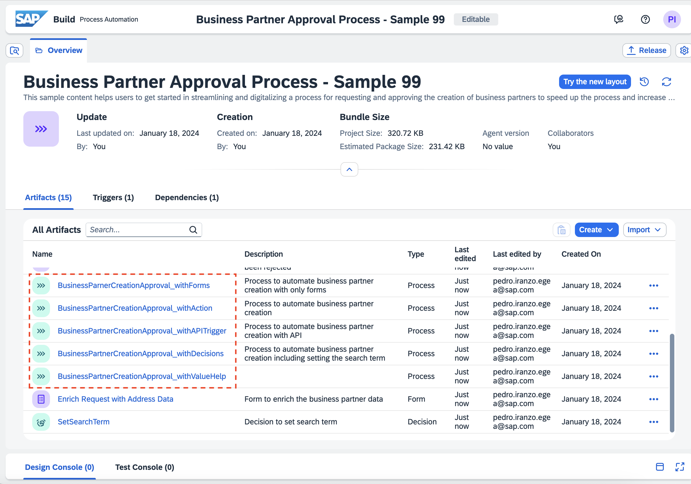

# Next steps in SAP Build Process Automation

---

This scenario tries to give you a quick demonstration of some of the features available in SAP Build Process Automation.

## Explore the Store: Business Partner template

SAP offers pre-made projects for the most popular workflows and processes. They can be business processes, actions, bot automations...

> [!INFO]
> You can access the store from the lobby, and also publicly from the [SAP Business Accelerator Hub - Process Automations](https://api.sap.com/content-type/Workflow/build/packages)

There is a _Business Partner Approval Process_ project in the Store, that covers the same scenario you just built, and explores more features. Let's see how you can import content from the store:

1. From the SAP [SAP Build Lobby](https://build02-worksop.eu10.build.cloud.sap/), click in _Store_. In the search field, type `business partner`. Click _Create from template_ on the project _Business Partner Approval Process - Sample_

    

2. Add your number **${number}** to the name and click _Create_:

    

    The project will open automatically when the import is finished. If not, go to the Lobby and open the project.

3. You will land in the Overview page of the project. In the artifact list, you will find familiar things: Forms, data types, processes... Explore the different processes and notice how they implement _Business Rules_, _Value Helps_

    

    

> [!TIP|icon:fa-solid fa-check|label:Congratulations]
> You have successfully imported a project! Explore the store to find other projects in areas of interest!

## Explore the Discovery Center

[Discovery Center](https://discovery-center.cloud.sap) is a great place to start exploring the SAP BTP service catalog. 

Take a look at the [SAP Build Process Automation](https://discovery-center.cloud.sap/serviceCatalog/sap-build-process-automation?region=all) page. Documentation, tutorials (missions), roadmap, pricing and customer stories are available here:

