Create an Automation to Extract Data

Prerequisites

- A windows machine

- [<u>Install and Setup the Desktop
  Agent</u>](https://developers.sap.com/tutorials/spa-setup-desktop-3-0-agent.html)

- Import [<u>Build Your First Business Process with SAP Build Process
  Automation </u>](https://sap-my.sharepoint.com/:u:/p/floria_qian01/EWEUDAwwVlRJlLcoh7fVwPoBZCkSlJ90FvovPr69DfD9jw?e=yjZqPL)

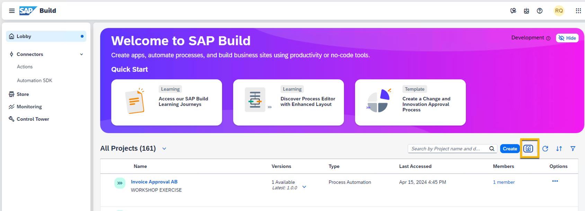

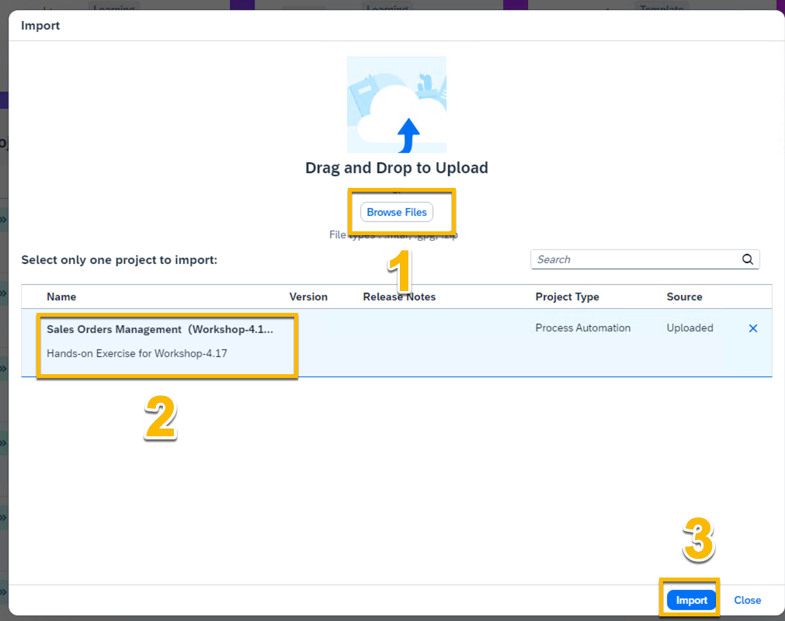

An Automation is a succession of steps to orchestrate multiple
activities and applications on a local machine.

- **STEP 1**

> Create the automation
>
> In this exercise, you will automate the process to read the sales
> order details from an Excel and select the specific sales order
> details based on the input from the submitted form. To design the
> automation, you will need an Excel file filled with the sales order
> data. You can:

- Download [<u>Sales Order
  Data</u>](https://sap-my.sharepoint.com/:x:/p/floria_qian01/EckuMQDr7JtBmUCKLsyYx7sB_aCRVXYqRkOTyB1OZ78LtA?e=W3BHfO) 

- **OR**

- Create the file yourself using the following data:

| Order Number | Order Amount | Order Date | Shipping Country         | Expected Delivery Date | Order Status |
|--------------|--------------|------------|--------------------------|------------------------|--------------|
| PO7991       | 410418.22    | 1/21/2022  | United States of America | 1/29/2022              | In Time      |
| PO7918       | 150935.13    | 1/22/2022  | United Kingdom           | 1/27/2022              | Urgent       |
| PO7375       | 313977.82    | 1/23/2022  | United Kingdom           | 2/20/2022              | In Time      |
| PO7311       | 755055.4     | 1/24/2022  | United Kingdom           | 3/30/2022              | In Time      |
| PO6858       | 429358.4     | 1/25/2022  | United Kingdom           | 2/20/2022              | In Time      |
| PO6368       | 43739.82     | 1/26/2022  | India                    | 3/25/2022              | In Time      |
| PO6189       | 483574.12    | 1/27/2022  | Germany                  | 2/5/2022               | In Time      |
| PO3115       | 273993.56    | 1/28/2022  | Germany                  | 3/10/2022              | In Time      |
| PO2686       | 220887.56    | 1/29/2022  | Germany                  | 3/5/2022               | In Time      |
| PO8282       | 436955.64    | 1/30/2022  | United States of America | 3/30/2022              | In Time      |

1.  In the Lobby from the editable version of your project, do the
    following:

    - Select the process Order Processing.

    - Choose +.

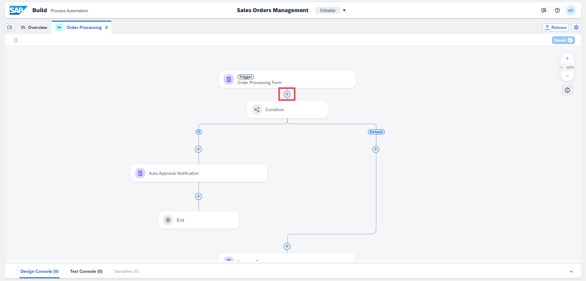

2.  Select Automation.

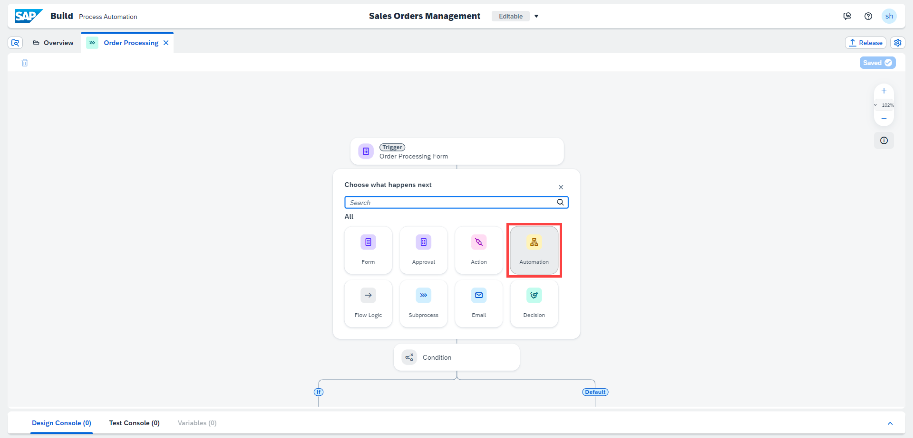

3.  Choose Blank Automation.

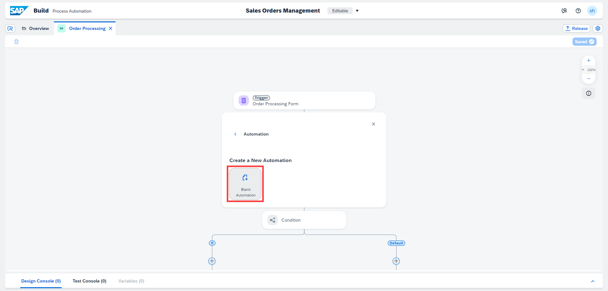

4.  A pop up will appear to configure the Desktop Agent version. Do the
    following in the pop up:

    - From the dropdown, select the version of the Desktop Agent
      installed on your machine. It would be displayed with suffix
      as Registered.

    - Under Platforms, choose Windows or Mac depending on the Platforms
      you are working on.

    - Choose the Confirm button.

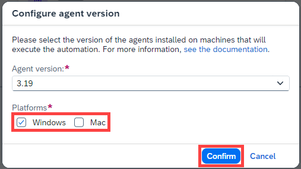

5.  A new pop-up will appear to create the automation. Do the following
    in the pop-up:

    - Under Name enter: Get Order Details.

    - Under Description enter: Automation for Order Process.

    - Choose the Create button.

> Identifier will be auto-filled.

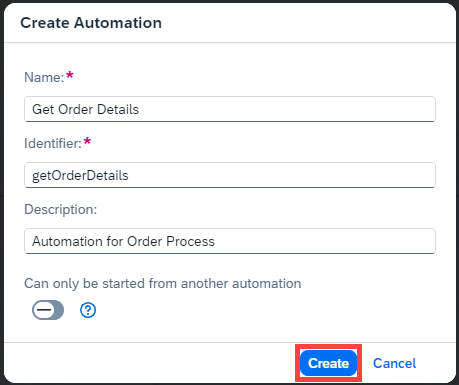

An automation Get Order Details will be created successfully.

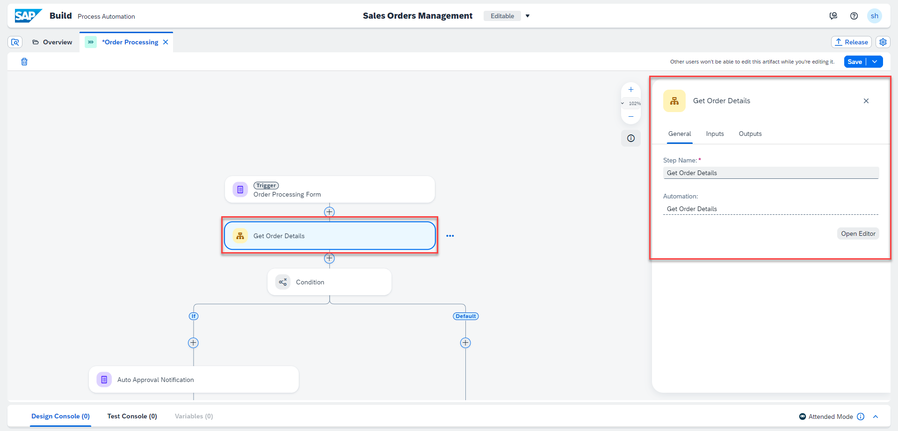

**STEP 2**

Create environment variable

Business projects usually need to use parameters and variables at
runtime. These variables are usually saved in their runtime landscapes
for example Dev, Test or Production environments. In this case, you will
need to maintain an environment variable that will contain the file full
path of the Excel file used in the automation.

Environment Variables allow you to reuse certain information for a given
environment. You use environment variables to pass parameters to
automations.

1.  Select Settings.

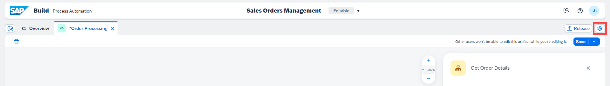

2.  In the Project Properties window, select Environment Variables,
    then + Create.

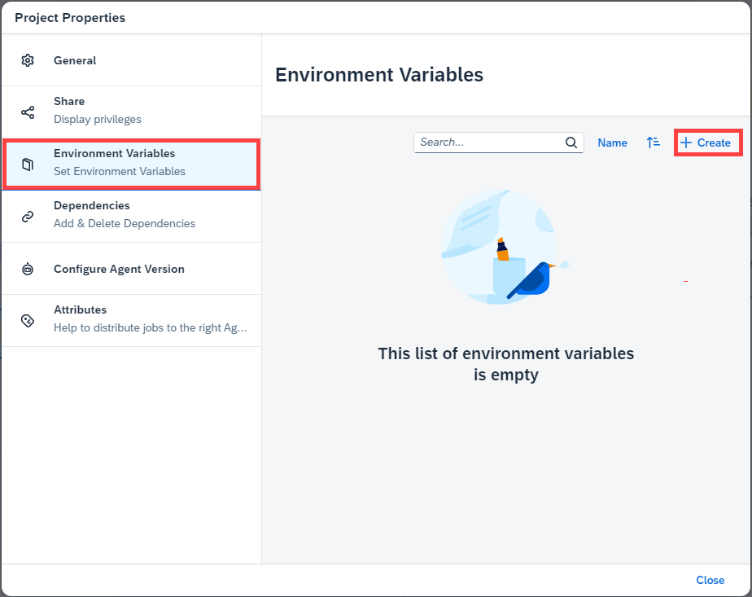

3.  In the create an environment variable screen:

    - Under Identifier enter: OrderFilePath.

    - Under Type select String.

    - Choose the Create button.

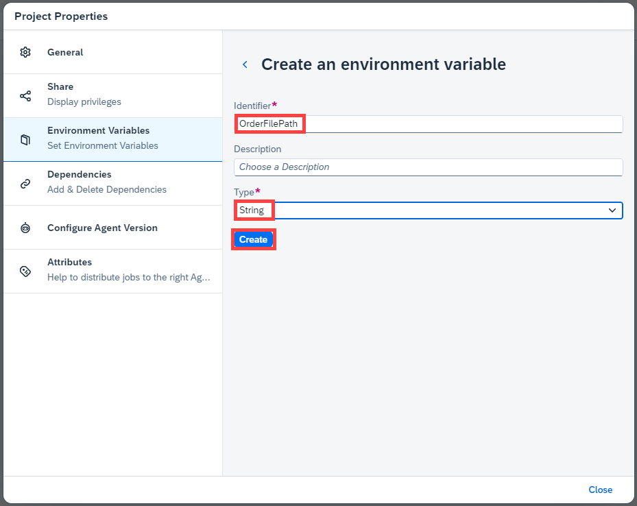

4.  After the Environment Variable is created successfully, close the
    project properties window.

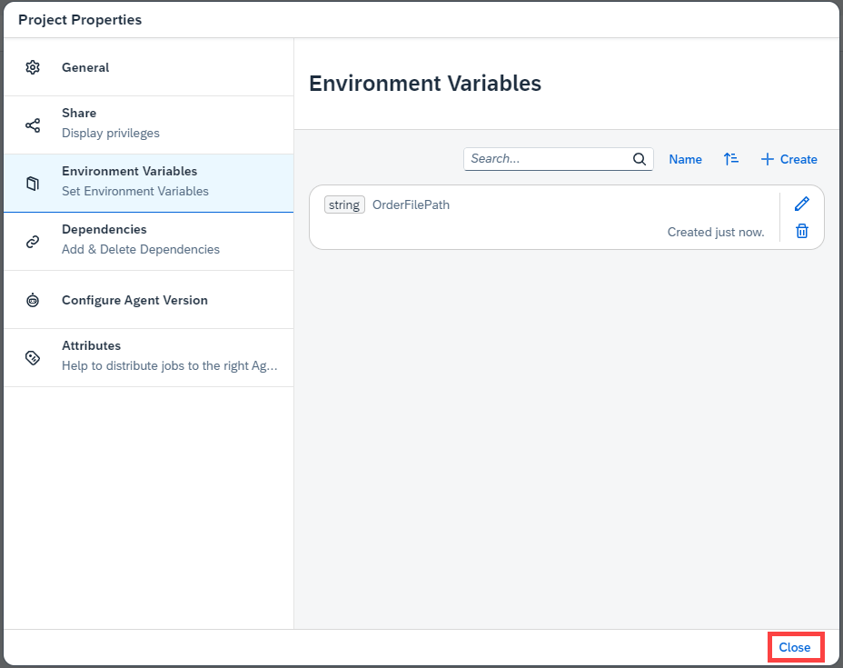

**STEP 3**

Add Excel activities

You will now design the automation in the Automation Editor by
dragging-and-dropping activities into the workflow of the automation.
Later you will configure the inputs and outputs of each activity. You
will need activities to interact with the Microsoft Excel application.
These activities will open the Excel application, open the workbook that
contains the sales orders details, and map them into a data type that
will be created during the design. Last, after extracting and mapping
the data, the Excel application will be closed.

1.  Select three dots next to Get Order Details, choose Open Editor,
    which navigates to the Design Studio to build the automation.

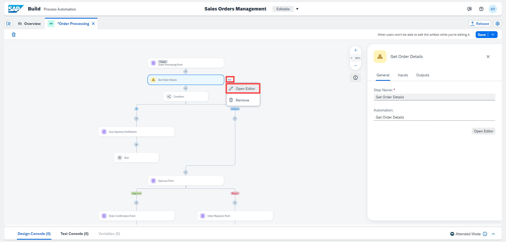

Since Excel is used in this automation, you have to open an Excel
instance. Open Excel Instance is a mandatory activity to use when using
Excel. Once you open an Excel instance, you can use other Excel
activities.

2.  To open the Excel Instance:

    - In the Automation Details section on the right, search for
      the Open Excel Instance activity,

    - Drag and drop the activity into the canvas.

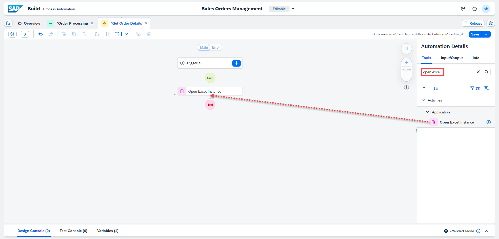

Next, Excel Data Mapping is done with the Excel Cloud Link activity.
Excel Data Mapping allows you to transform columns-based data from an
Excel sheet into data that can be used in the automation. The data from
the Excel sheet stays the same but the structure becomes a data type
structure, making it possible to use throughout your project.

3.  To get the Excel Cloud Link:

    - In the Automation Details search for the activity Excel Cloud
      Link,

    - Drag and drop the activity into the canvas.

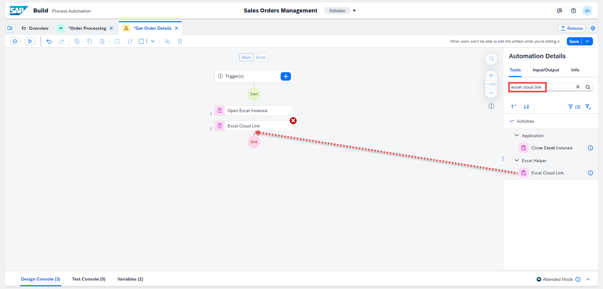

4.  Select Excel Cloud Link, in the details on the right side, choose
    the Edit activity button.

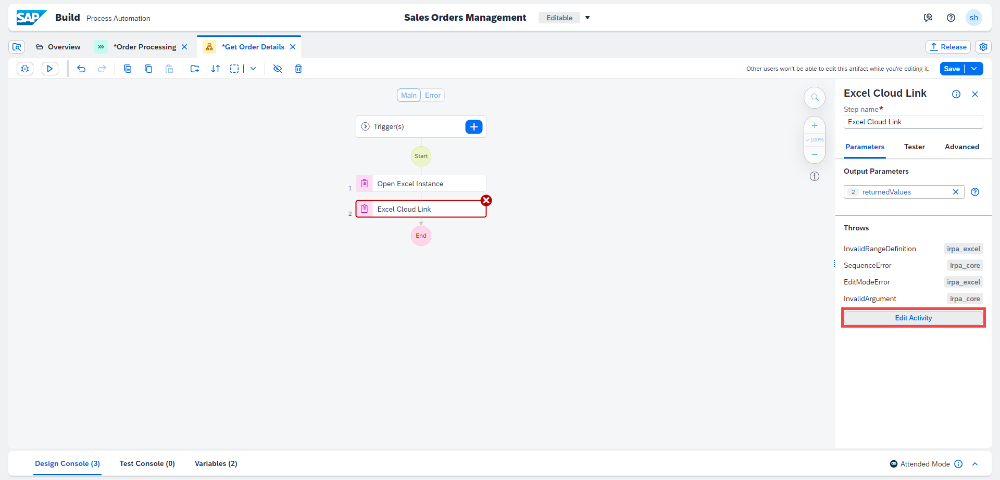

5.  In the Excel File screen:

    - Select Browse.

    - Choose the Orders.xlsx file which is saved on your machine.

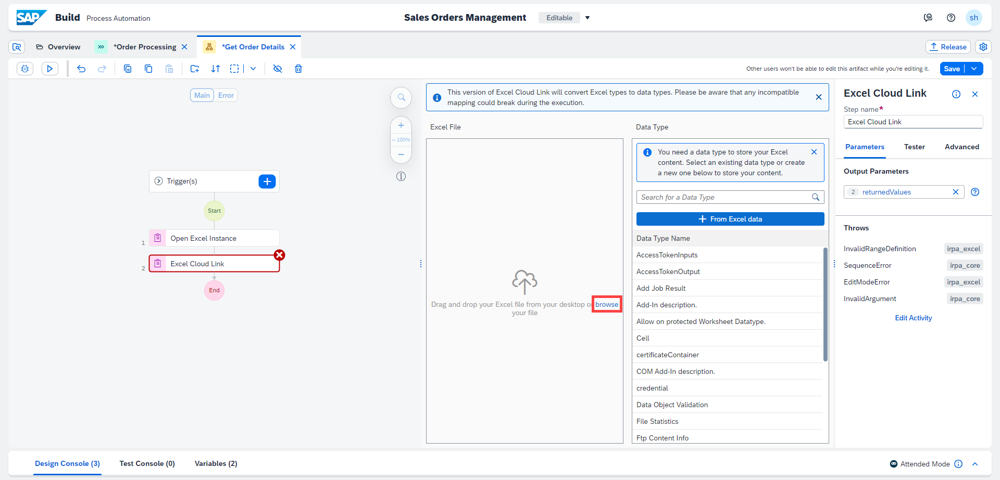

> The Excel file is mapped automatically.

6.  In the Workbook Path field enter the Environment Variable
    as OrderFilePath, which was created above as the parameter value
    for Workbook path.

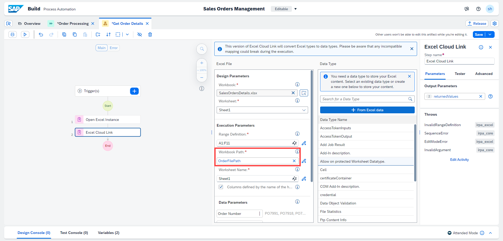

7.  Select the button + From Excel data.

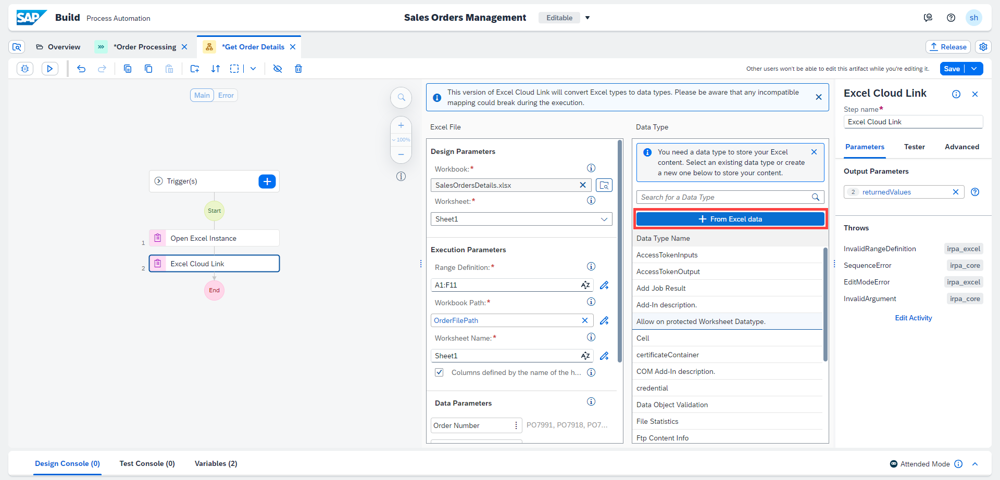

A pop up appears to create a data type. A Sales Order variable is needed
to collect the data from the Excel sheet columns. In this step, a
variable is automatically created from the Excel file columns.

8.  Under Name of the data type, enter Sales Order and choose
    the Create button.

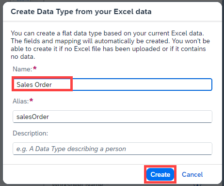

> Framework creates a data type with the columns of the Excel as the
> field names. You can see it in the Artifacts section in the Overview
> tab.

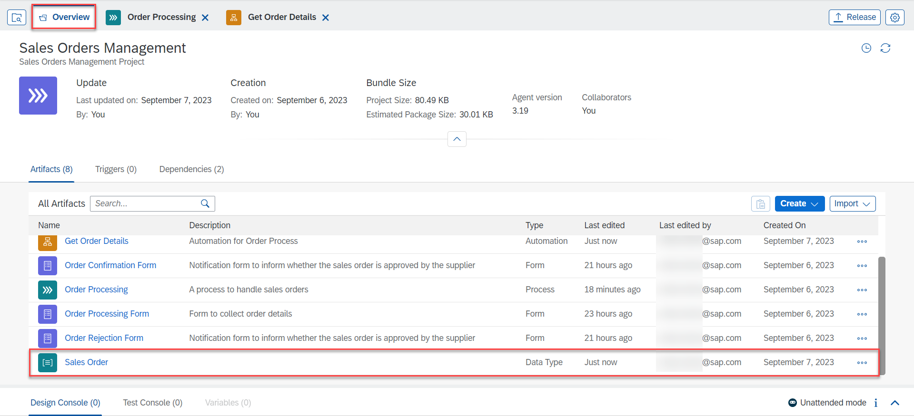

9.  Go to Get Order Details automation. In Excel Cloud Link activity on
    the right side, under Output Parameters, manually change the
    variable name to Orders.

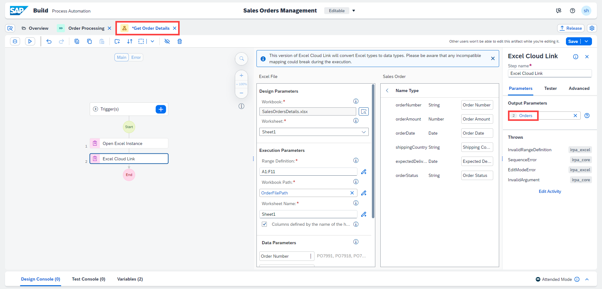

10. Close the activity.

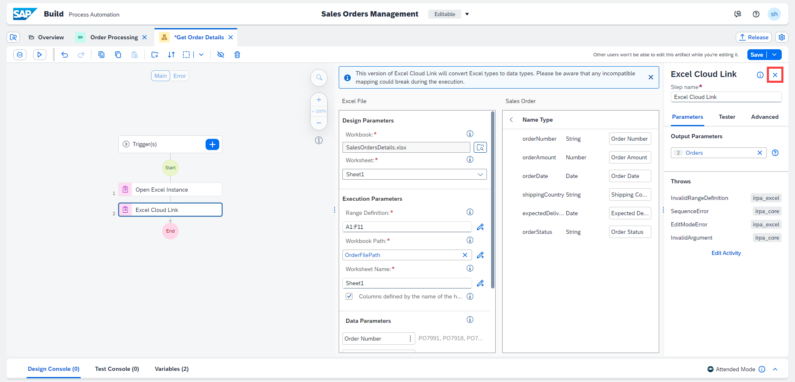

11. Click on the canvas.

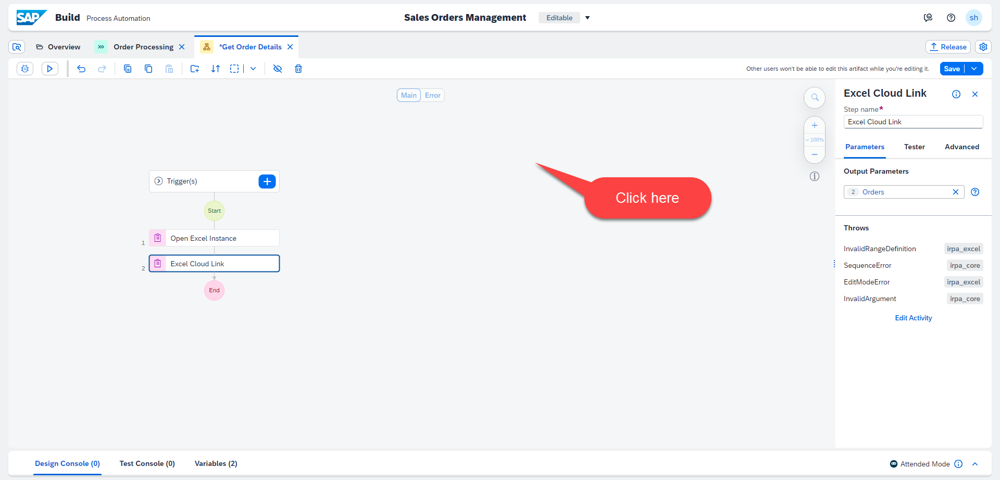

Once Excel is no longer required, close the Excel instance. Close Excel
Instance activity closes an instance of Excel.

12. To close the opened instance of the Excel file:

    - In the Automation Details search for the activity Close Excel
      Instance.

    - Drag and drop the activity into the canvas and save your
      automation.

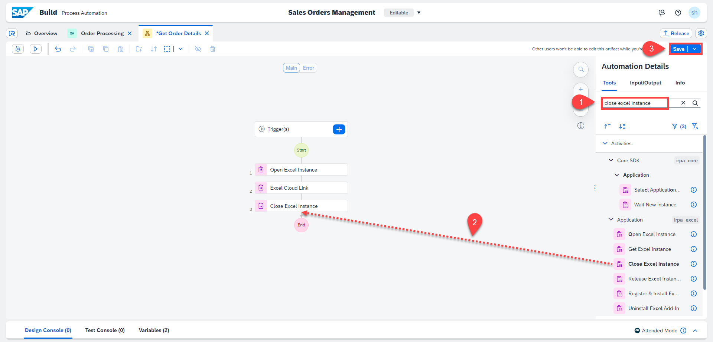

**STEP 4**

Add input and output parameters

Input and output parameters allow you to exchange data in the workflow
of your automation between activities, screens, and scripts.

1.  Click on the canvas and select the Input/Output section in
    Automation Details.

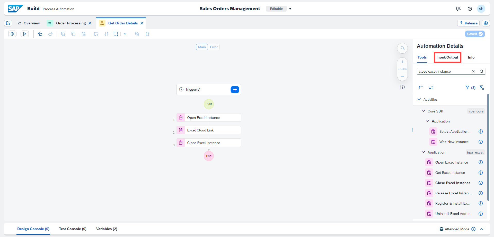

2.  Add Input parameters as following:

    - In Parameter Name enter: OrderNumber.

    - In Description enter: Receives order number from the Order
      Processing Form.

    - In Data type choose: String.

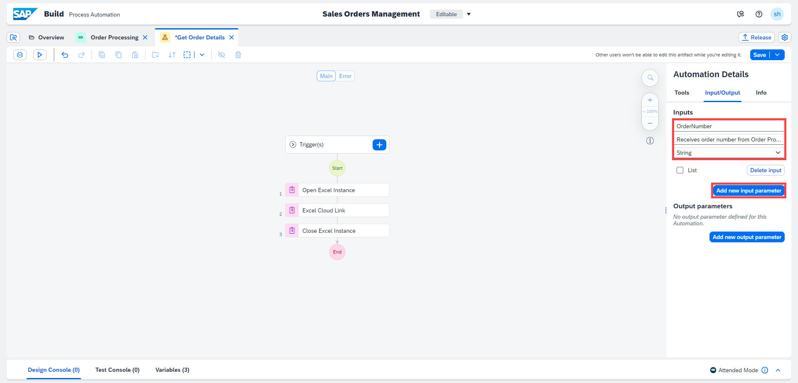

3.  Add Output parameters as following:

    - In Parameter Name enter: SelectedOrder.

    - In Description enter: Selected order details are passed to the
      Process.

    - In Data type choose: Sales Order.

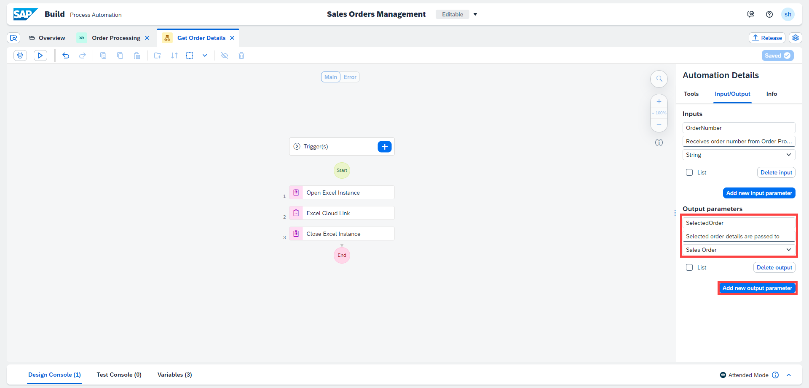

4.  Save your work.

**STEP 5**

Create a variable

Variables that are used, build your automation, and are data storage
that have a name, a type (example: string, list of string or data type),
and a value. A variable in the automation is also associated to a step
represented by its number.

1.  In the Automation Details under Tools:

    - Search for the Sales Order data type (created in the previous
      step).

    - Drag and drop the Sales Order data type into the canvas.

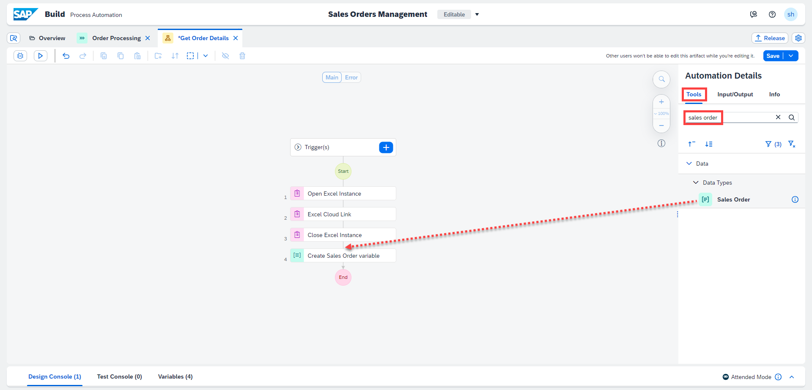

> A variable of the data type Sales Order is created.

2.  Select Create Sales Order variable. Under Output Parameters enter
    the value as selectedOrderDetails.

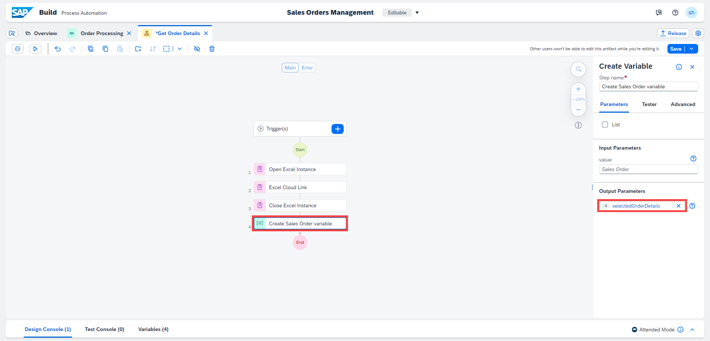

3.  Save your work.

**STEP 6**

Looping through Excel sheet and searching for the order

Now you will loop through each Order from the Excel sheet, retrieve the
order details for order number submitted in the Order Processing
Form. For Each control allows you to go through a list of members
provided as input to your automation, and execute an action for each
member in that list.

This control has the following loop parameters:

- currentMember - The member of the list for the current loop iteration.

- index - An integer that is the index of the current loop iteration,
  starts at 0.

1.  To loop through each order:

    - Click on the canvas.

    - In Automation Details search for the control For Each.

    - Drag and Drop the activity into the canvas.

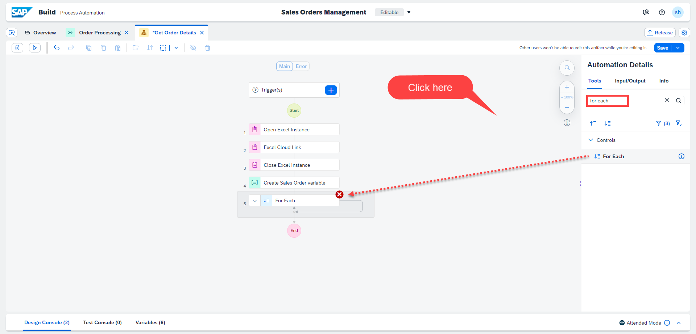

2.  Select For Each activity, enter the value of Set looping List
    as Orders.

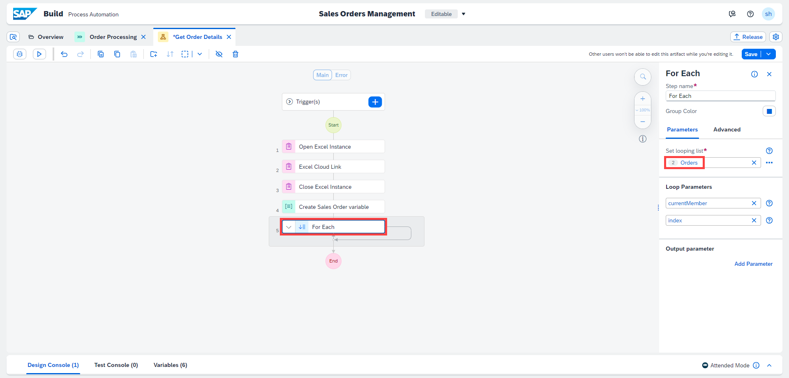

To match the desired order, a control activity has to be added to search
for a match to its order number. The Condition activity is the activity
that you will add. In this condition, you will check if the order number
entered in the Form is available in data read from Excel in Step 2.

3.  To add the condition:

    - Click on the canvas.

    - In Automation Details search for the activity Condition.

    - Drag and Drop the activity inside the For Each block.

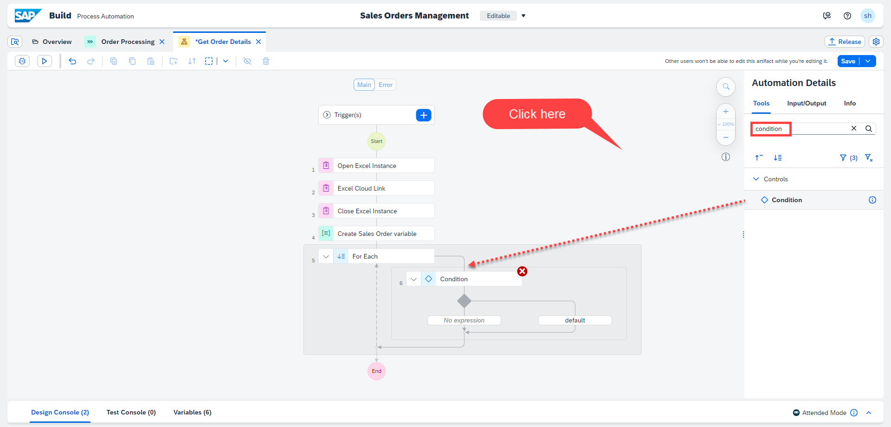

4.  Choose Condition, select three dots next to Condition Expression
    field, select Edit Formula.

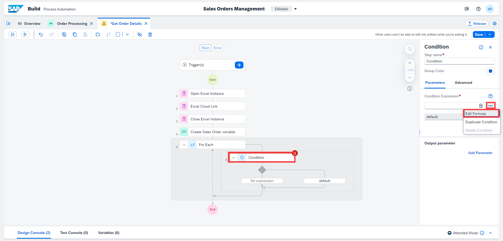

5.  A pop up window appears to enter the condition expression:

    - You can enter this expression manually or you can expand
      the Variables list and select the given variables to form the
      expression: Step0.OrderNumber === Step5.currentMember.orderNumber.

    - Select the Save Expression button.

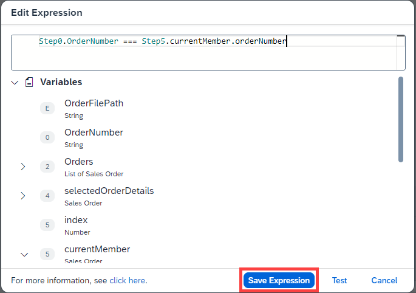

> If the order number is found in Excel, i.e. the condition is True, set
> the variable using Set Variable Value activity that is a Data
> Management activity.

6.  To add Set Variable Value:

    - Click on the canvas.

    - In Automation Details search for the activity Set Variable Value.

    - Drag and Drop the activity into the canvas below the condition you
      set.

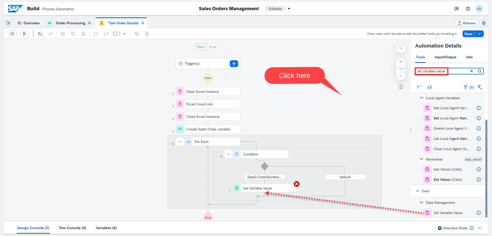

7.  Select Set Variable Value. In the configuration screen on the right,
    do the following:

    - In the variable field enter selectedOrderDetails.

    - In the value field enter currentMember.

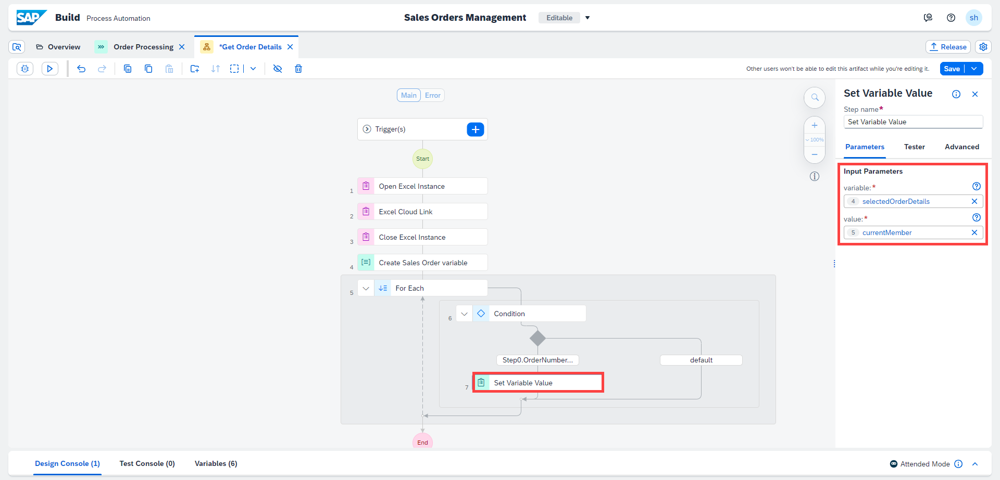

> Once the order number is found in the Excel, use the control End
> Loop to stop the loop.

8.  To end loop:

    - Click on the canvas,

    - In Automation Details search for the activity Loop End,

    - Drag and Drop the activity into the canvas just below the Set
      Variable Value.

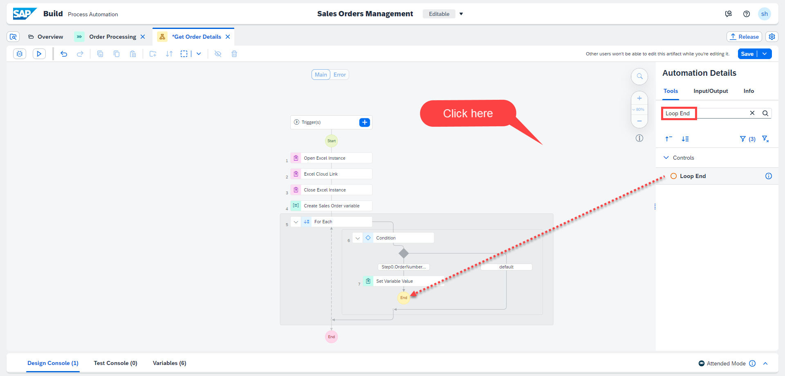

9.  Use Log Message activity to print your results. To add Log Message:

    - In Automation Details search for the activity Log message,

    - Drag and Drop the activity into the canvas outside the For
      Each loop.

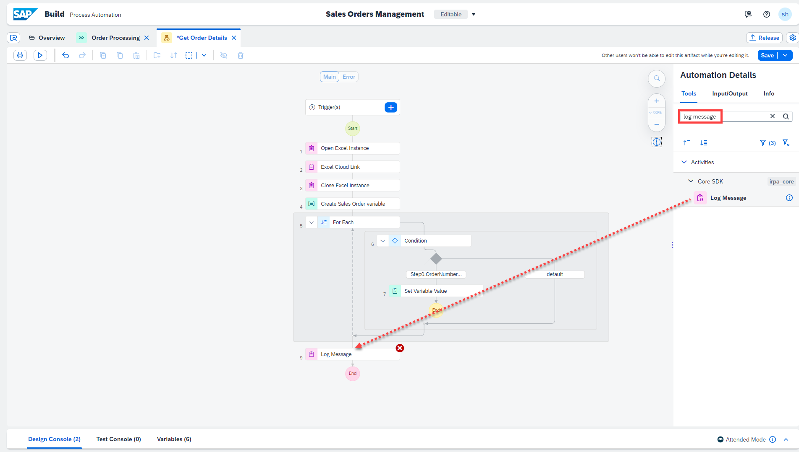

10. Use the activity to check selectedOrderDetails in testing mode. To
    do that:

    - Select Log Message,

    - In message field, select selectedOrderDetails.

11. Save your work.

**STEP 7**

Link automation parameters with business process

Apart from creating an output parameter, it is mandatory to pass the
data through the End step to expose the data outside the automation.

1.  To do that:

    - Select End.

    - In the configuration screen on the right, under the Output
      Parameter, in the SelectedOrder field enter selectedOrderDetails.

    - Save the Automation.

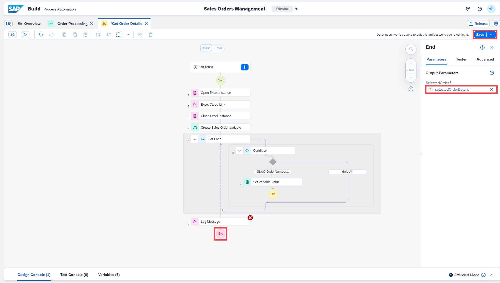

> Make sure to add the steps Condition, Set Variable Value, End
> Loop inside the For Each block.

2.  The complete Get Order Details automation looks as below.

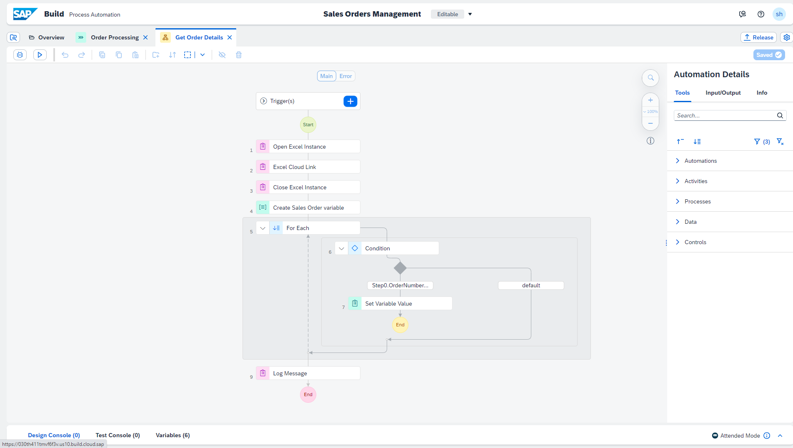

> Now you will map the Automation Parameters with the Form Parameters.

3.  Select Order Processing process. Choose Get Order Details automation
    in the process.

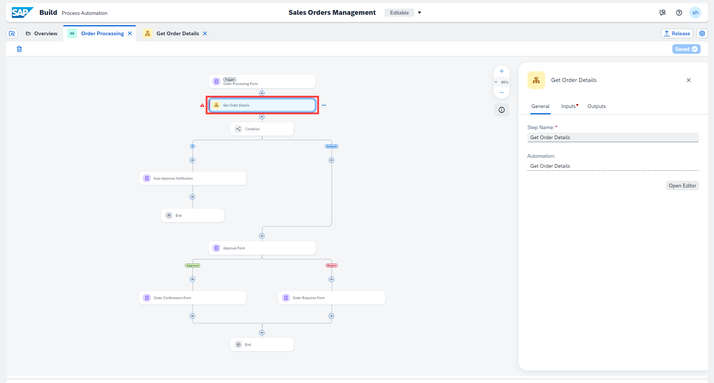

4.  In Get Order Details, map the input parameter OrderNumber of the
    automation with the Order Number of Order Processing Form.

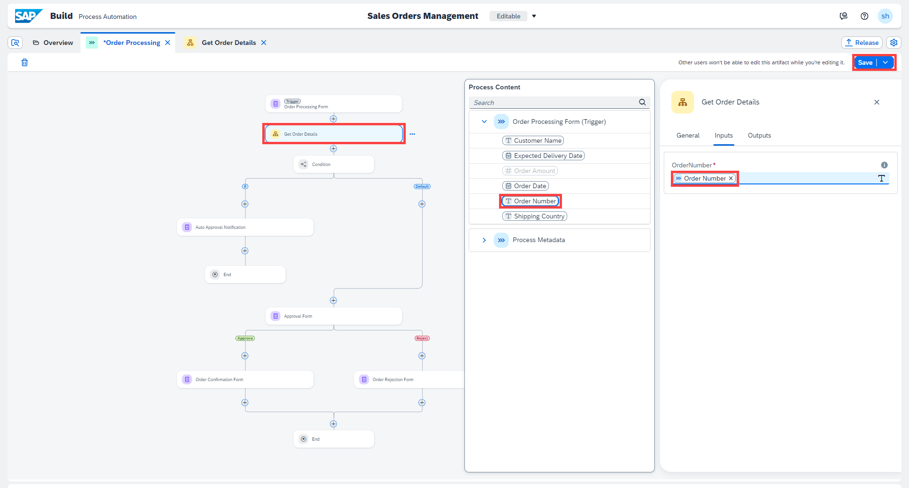

5.  Choose the Save button.

**STEP 8**

Test the automation

1.  Navigate back to the automation Get Order Details and choose
    the Test button.

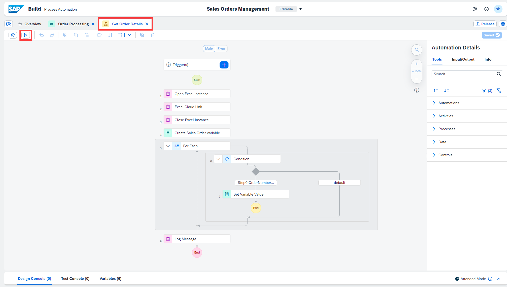

2.  In the Test Automation window, enter the parameters to test the
    Automation:

| **Parameter** | **Value**                                                             |
|---------------|-----------------------------------------------------------------------|
| OrderNumber   | Any order number which is available in Sales Order Data Excel         |
| OrderFilePath | Path where the Sales Order Data Excel is stored on your local machine |

3.  Select Test button.

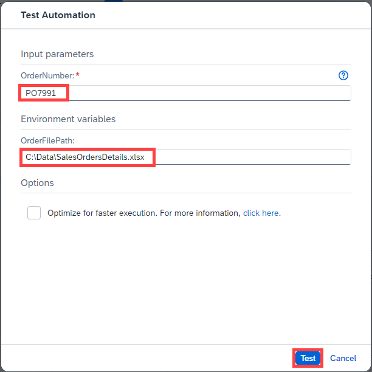

4.  Test Results:

    - Automation opens the SalesOrderDetails Excel.

    - Reads the Excel content.

    - Closes the Excel.

    - Loops through Excel and verifies if entered OrderNumber is
      available in the Excel. If the OrderNumber is available in the
      Excel, it sets the Orders Details.

    - Ends the looping.

    - Prints the selected order details.

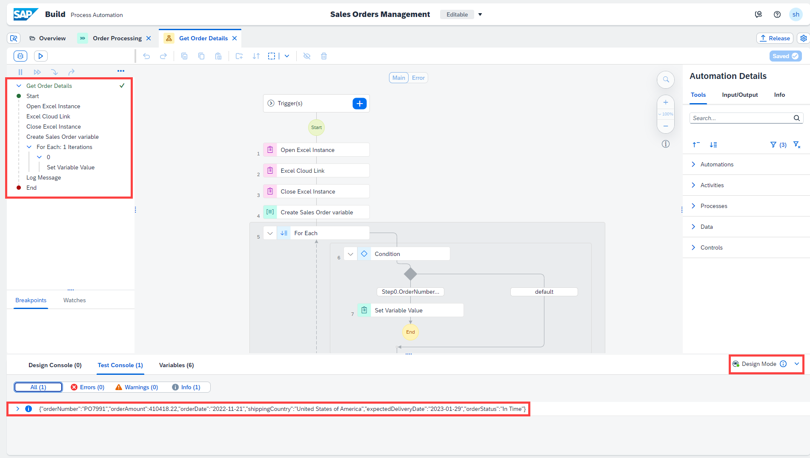

**STEP 9**

Simplify the start form

After the design of the automation that retrieves the data form the
Excel file, simplify the start form by deleting the not needed fields.

1.  In the Order Processing tab :

    - Select three dots next to Order Processing Form.

    - Select Open Editor.

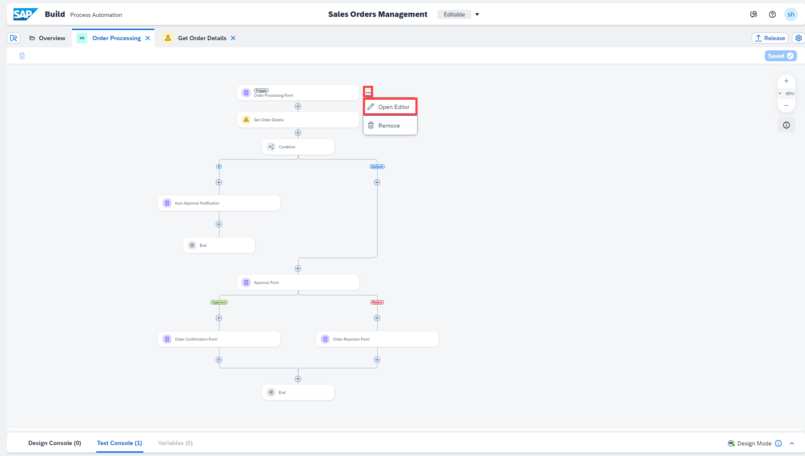

2.  In the form delete following inputs by selecting the 3 dots next to
    each input menu and selecting Delete:

    - Order Amount.

    - Order Date.

    - Expected Delivery Date.

    - Shipping Country.

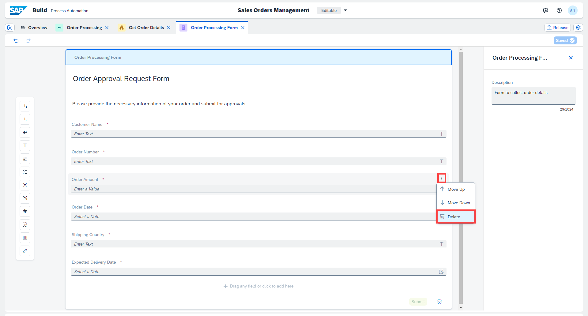

3.  Save the Form, close the Form Editor and go back to the Order
    Processing tab.

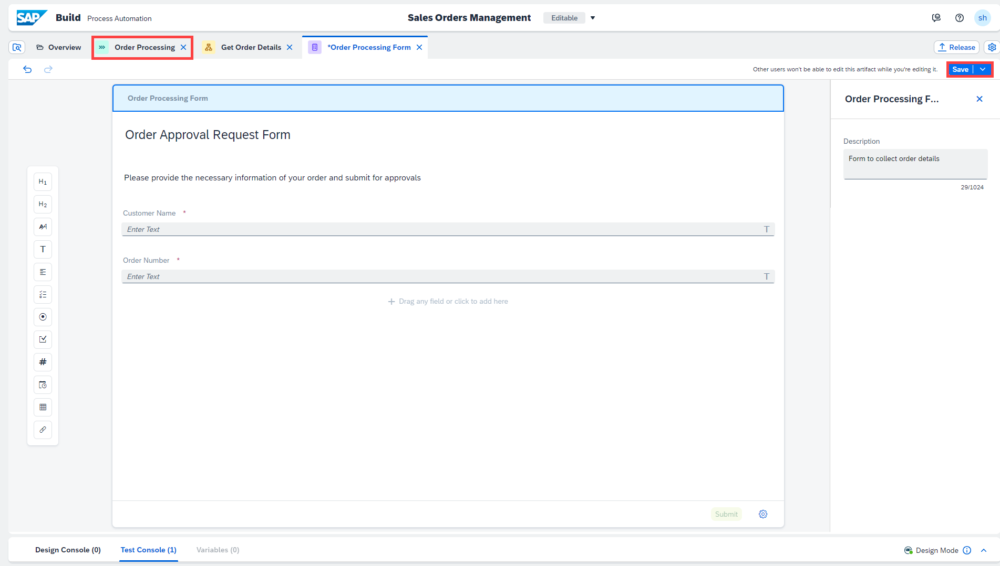

**STEP 10**

Update Process Condition

Since you have created an automation Get Order Details to collect Order
Amount, Order Date , Expected Delivery Date and Shipping
Country directly from the Excel file, you need to update the process
condition which previously was dependent of Order Processing
Form outputs.

1.  Click on Condition and choose Open Condition Editor.

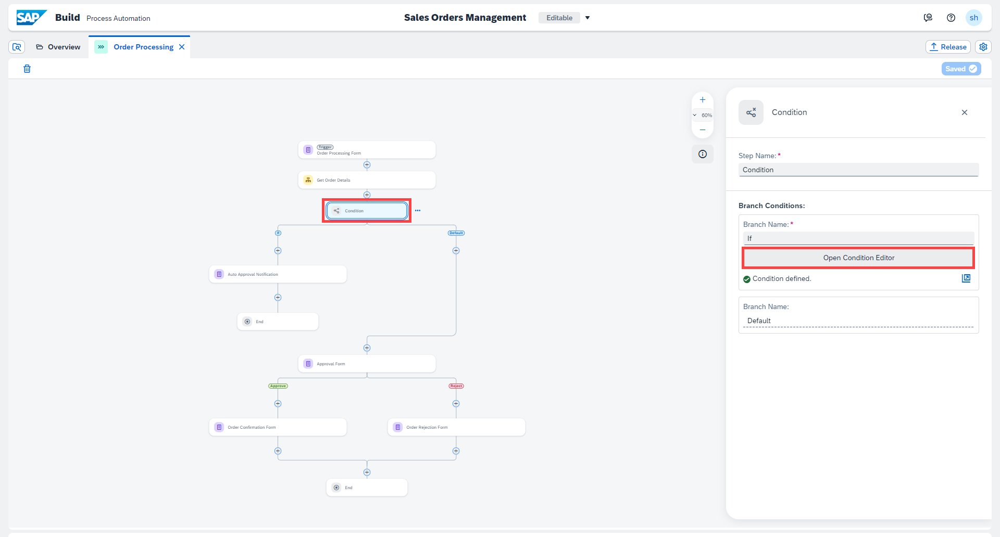

2.  In the Edit Branch Condition, select conditions :

| Item            | Condition    | Value   |
|-----------------|--------------|---------|
| orderAmount     | is less than | 100000  |
| shippingCountry | is equal to  | India   |
| shippingCountry | is equal to  | Germany |

3.  Choose Apply to add the condition to the business process.


**STEP 11**

Mapping forms of the process

The different Forms of the process will need Inputs mapping from the
automation Outputs.


1.  Select the Auto Approval Notification and go to the Inputs :

    - In the Order Amount field, choose the orderAmount from the
      Automation outputs.

    - In the Expected Delivery Date field,
      choose expectedDeliveryDate from the Automation outputs.


2.  Select the Approval Form and go to the Inputs :

    - In the Order Amount field, choose the orderAmount from the
      Automation outputs.

    - In the Expected Delivery Date field,
      choose expectedDeliveryDate from the Automation outputs.


3.  Do the same for the Order Confirmation Notification.


4.  Do the same for the Order Rejection Notification.


5.  Save the Process.


You have successfully completed creating an automation in your process.

Create a Decision

Prerequisites

- [<u>Create an Automation to Extract
  Data</u>](https://developers.sap.com/tutorials/spa-vl-create-automation.html)

<!-- -->

- **STEP 1**

> Add a Decision to the Process
>
> A decision consists of one or more policies. Each policy consists of a
> collection of rules. They are used to automate the decision-making
> parts of a business process. After you create a decision, define your
> business logic by adding rules to the policy. There are two types of
> rules:

- Decision Table Rule: A decision table is a collection of input and
  output rule expressions in a tabular representation.

- Text Rule: A text rule is the collection of rule expressions in a
  simple if-then format.

> To add a decision, you must first identify the set of rules that you
> need to add to the decision-making process. Once you have identified
> your rules, then define the data types relevant for designing the
> rules. This is an important step before you start modelling your
> decision because these data types will contain all necessary fields
> that will be needed to model the rule.
>
> In this section, you will create and configure a decision which will
> be used to determine the relevant approvers based on the sales order
> fields.

1.  In the process builder, choose + of the default conditional flow.


2.  Select Decision.


3.  Click on Blank Decision.


4.  In the Create Decision window, do the following:

    - In the Name field enter Determine Approver,

    - In the Description field enter Rule to identify the potential
      approvers for sales order,

    - Choose Create button.


5.  Now you have to model the decision. For that, choose the 3 dots next
    to Determine Approver decision, to open the menu and choose Open
    Editor.


6.  A decision editor opens. You can see the decision diagram on the
    left panel and configuration option for Input and Output on the
    right panel. Notice the default policy that is pre-created with the
    decision.

A Decision Diagram is a flow chart that describes the execution flow of
the decision logic from the input to the output. Using a decision
diagram, you can view the input, output, policies of a decision and the
rules of the policies. You can also access each component of a decision,
like a policy or a rule, via the decision diagram itself.

A Policy is a collection of rules to be executed in strict order,
meaning that they will run in the order in which they are added to the
policy, and only the results of the last rule execution will be given as
the final output of the decision.


> Completed

- **STEP 2**

> Create Data Types
>
> A data type describes the data structure that can be used as an input
> and/or output parameter in an automation, a decision or processes.
> Data types enable you to formalize the data used as input/output
> parameters for steps, activities, skills, processes, scenarios,
> triggers, or notifiers. Data types facilitate the manipulation and
> validation of data.

You can create a data type manually, but some data types can also be
created automatically when SDK packages or pre-packaged scenarios are
imported or after running an automation.

Now, you have to map the Input and Output of the decision to the actual
data object available with the process. In this section, you will use
Sales Order as the Input data object and Approver as the Output data
object. While the Sales Order was already created in the automation
step, you will create an Approver data object for decision output.

1.  Click on the Open Project Content icon as below.


2.  Select +. Choose Create \> Data Type.


3.  In the Create Data Type window, do the following:

    - In the Name field enter Approver,

    - In the Description field enter Approver details who will approve
      the order from supplier side,

    - Choose Create button.


4.  In the Approver data type screen, choose New Field to add a new
    attribute to the data object.


5.  In the Field Details section on the right, in the Name field
    enter Email. Keep the Type as String.

You can choose the Type dropdown list to see the different kind of data
types that are supported like Number, Password, Date, Time, Boolean etc.


6.  Similarly, add another attribute UserGroup of Type String to the
    data type.


7.  Save changes.


> Completed

- **STEP 3**

> Configure Decision
>
> After the data types are created, you will now configure the decision:

- With Input and Output data types.

- Create decision table rule to the business policy.

> First, add this newly created data object as the decision output.

1.  Go back to Determine Approver decision tab.


2.  In the Determine Approver section, you will select Add Input
    Parameter button and Add Output Parameter button to configure input
    and output parameters.


3.  Configure Input Parameter:

    - In Name enter: Sales Order Input,

    - In Description enter: Business rules input,

    - In Type choose: Sales Order.


4.  Configure Output Parameter:

    - In Name enter: Approver Output,

    - In Description enter: Business rules output,

    - In Type choose: Approver.


5.  Save changes.

6.  Then you will create the actual decision-making parts that make the
    decision in the process. Under Determine approver, select Rules.


7.  Select Add Rule.


8.  In the Create Rule window:

    - Under Rule Type select Decision Table,

    - In the Rule Name enter Determine Approver,

    - In the Rule Description enter Rule to identify the potential
      approvers for sales order,

    - Choose Next Step button.


A decision table is a tabular representation of the rule with If and
Then header and row columns. If-header columns contain the expressions,
which are evaluated, and Then-header columns contain the result
structure that will be returned after the decision is run.

9.  You will now configure the conditions. Under Vocabulary:

    - Select Sales Order Input data type,

    - From the dropdown, choose the
      inputs shippingCountry and orderAmount,

    - Choose Next Step button.


10. Configure the output or result of the decision table. Under Result
    Vocabulary:

    - Select Approver Output data type,

    - From the dropdown, choose outputs UserGroup and Email,

    - Choose Next Step button.


11. Review and choose Create button to create the rule.


You can use the Settings option to easily define these If and Then
header expressions with inline suggestions or free-flow typing.

12. In the newly created Decision Table, add values to condition and
    result columns.


13. Click in the first field (first column)


14. Type EXISTSIN, and choose exists in from Array Operators.


15. Continue typing, and write this expression: EXISTSIN \[‘United
    Kingdom’, ‘India’ , ‘Germany’\]. After you have finished, press
    Enter key or click outside the input field to confirm.

> You can either type-in the entire expression as free-flow or use the
> context help to write the expression.


Remember that for all String type data object attributes, you must add a
single quote (’) before and after the text.

16. Choose the input field of Order Amount column (second column of the
    decision table) and enter \<= 100000.


17. Similarly, enter the following expressions for the respective result
    column (or Then section):

    - Under UserGroup enter: 'SO_APPROVER'

    - Under Email enter your email such as 'jane.doe@sap.com'

> Do not forget to put single-quote (’) for string type values.


User Group is a role collection or group created in the BTP cockpit or
in your respective user management system. These groups have users who
are responsible for certain jobs. The advantage of using groups is that
you can add/remove users from these groups without the need to change
the decision.

To ensure that the decision table rule returns definite output for all
kinds of sales orders, add one more row to the decision table to return
the list of approvers who can approve the sales order for value greater
than 100000.

So, for example, for all sales orders coming from India, Germany, or the
United Kingdom (the defined shipping countries) which have a value
smaller or equal than 100,000 – the first row will run. For all other
sales orders, whose value is greater than 100000, the second row will
return; and for any other combination that does not match the rows – an
empty result will be returned.

18. To add a new row to the decision table, do the following:

    - Choose the check-box of the first row,

    - Choose Add Row,

    - From the dropdown options, select Insert After.


19. Similarly, enter the following values for the new row:

| **Condition Column** | **Value** |
|----------------------|-----------|
| Shipping Country     |           |
| Order Amount         | \>100000  |

20. 

| **Action Column** | **Value**          |
|-------------------|--------------------|
| UserGroup         | 'SO_MGMNT'         |
| Email             | 'john.doe@sap.com' |

21. Choose Save button.

> Save will both save and activate the decision table. If there are any
> validation issues in the decision table, then Save will not happen and
> the errors will be shown in the Design Console.


> Completed

- **STEP 4**

> Configure Decision in Process Builder
>
> After you have created and configured the decision, next you have to
> map the input fields of the decision with the actual process content
> fields from the process builder.

1.  Open the process builder

    - Choose Determine Approver decision

    - Choose Inputs tab

    - Map the Sales Order Input choosing the SelectedOrder with Bind
      Object option

You might not see entries in the Input, please refer to [<u>the
Knowledge Base
Article</u>](https://launchpad.support.sap.com/#/notes/3207153) for the
complete workaround.


You can choose to map the Single Properties from the selected order
following decision table input with the process content:

| **Decision Input Field** | **Process Content**                   |
|--------------------------|---------------------------------------|
| expectedDeliveryDate     | selectedOrder \> expectedDeliveryDate |
| orderAmount              | selectedOrder \> orderAmount          |
| orderDate                | selectedOrder \> orderDate            |
| orderNumber              | selectedOrder \> orderNumber          |
| orderStatus              | selectedOrder \> orderStatus          |
| shippingCountry          | selectedOrder \> shippingCountry      |

2.  Save the process.


You might see an error symbol on your decision. This is because the
outbound connection from the decision is still dangling and not
connected to any activity. You may connect it to the end activity.

**What are different components of Decisions:**

- Input data object

- Decision table

- Form

- Decision diagram

- Business Logic

Congratulations! Your answer is correct

- **STEP 5**

> Update the Process

1.  You will now adapt the business process one last time to fully
    automate your approver selection by matching the recipients of the
    approval form to the one returned from the decision table.

2.  Select Approval form:

    - Match orderNumber from Get Order Details automation in the
      Subject,

    - Under Recipients \> Users select Email from Determine
      approver decision,

    - Under Recipients \> Groups select UserGroup from Determine
      approver decision.

> You can modify your selection as needed.


3.  Save your work.

Create Process Visibility Scenario

- How to create and configure a Process Visibility Scenario

- How to define performance indicators of a process by using visibility
  scenarios

- Why and how you can gain visibility into your processes to measure
  performance with SAP Build Process Automation

Prerequisites

- [<u>Create an Automation to Extract
  Data</u>](https://developers.sap.com/tutorials/spa-vl-create-automation.html)

- [<u>Create a
  Decision</u>](https://developers.sap.com/tutorials/spa-vl-create-decision.html)

The process is created where several forms are defined, an automation to
extract data is included in that same process and a condition to control
the flow and even improved the process with some decision logic are
used. Now it is time to measure success and improvements. In fact, you
will gain end-to-end process visibility. There is a comprehensive
dashboard with several process performance indicators, like process
cycle time, duration of individual steps or status of the running
processes – and this view is created automatically, in real time.

- **STEP 1**

> Prepare Process
>
> Before creating a Visibility Scenario, you need to prepare the
> process.

1.  In the Process Builder open the process and on the right-hand side,
    select 

>  alt="Process Details icon" />
>
>  icon to view the process details.


2.  Then, select the tab Visibility.


Here you define the connection between the process context and the newly
to be created visibility scenario.

3.  Select + on the right panel to add the relevant attributes from the
    process.


4.  Add the following attributes:

    - expectedDeliveryDate

    - orderAmount

    - orderDate

    - orderNumber

    - shippingCountry

    - Customer Name


> The relevant attributes are the ones that could be used to measure,
> calculate, or derive some meaningful information in the visibility
> dashboard.

5.  Save your work.

- **STEP 2**

> Create Visibility Scenario

1.  Select the Open Project Content icon as below.


2.  Select +. Choose Create \> Visibility Scenario.


3.  Set Name to Sales Order Visibility Scenario then click Create.


Please ensure you use a unique name, to make it easier to identify your
scenario later on.

The Visibility Scenario is created.

4.  Move to General tab in Sales Order Visibility Scenario and
    change: Instances to Sales Orders and Instance to Sales Order.

> To make it better understandable what the instances are processing:
> Sales Orders.


> Completed

- **STEP 3**

> Configure Visibility Scenario Process
>
> This step involves adding a process to the visibility scenario we
> created.

1.  Select +, then Add Process in Processes tab in Sales Order
    Visibility Scenario.


2.  Select Order Processing process.


This will lead to the visibility scenario configuration screen, where
these can be viewed and controlled:

1.  All the events that could potentially occur during the process
    execution

2.  The context data which is the attributes selected before (Step 1.3)

<!-- -->

3.  Change within the following context data the data types. Select the
    pencil icon.


| Name                 | Current Data Type | New Data Type |
|----------------------|-------------------|---------------|
| expectedDeliveryDate | String            | Date          |
| orderAmount          | String            | Double        |
| orderDate            | String            | Date          |


> Completed

- **STEP 4**

> Define Visibility Scenario Status
>
> This step involves configuring the visibility scenario’s status that
> allows to define under which circumstance a process instance will
> change the status to require special processing or actions.

1.  Move to Status tab in Sales Order Visibility Scenario.

2.  Change Target Type from None to Constant.


3.  Set Target Value to 10 Min and Threshold to 50%.


The means: as soon as processing duration crosses 5 minutes (50%
of Target Value), the status will switch to “At Risk”. After 10 minutes
it will change to “Critical”.

> Completed

- **STEP 5**

> Configure Visibility Scenario Performance Indicators

1.  Move to Performance Indicators tab in Sales Order Visibility
    Scenario and add additional ones or leave them as is.


2.  Click Save.

You have now configured a visibility scenario which is related to your
process. Based on this configuration a dashboard will be created which
you can use to measure the performance, but to also get deep insights
into single instances and even trigger actions.

In the next tutorial, you will run the process and will be able to
monitor the Process Visibility Dashboard.

Run the business process with a full monitoring of the workflow
instances and automation jobs

Prerequisites

- Complete <u>Agent Management settings to execute the process with an
  automation</u>

- Complete <u>Create an Automation to Extract Data</u>

- Complete <u>Create a Decision</u>

- Complete <u>Create Process Visibility Scenario</u>

<!-- -->

- **STEP 1**

> Release and deploy the business process


1.  Choose an Environment and select Deploy.


2.  While deploying, the OrderFilePath data type should be the path to
    the excel workbook saved on your machine.

3.  Choose Deploy.


> Completed

- **STEP 2**

> Run the business process
>
> You will now run the process and learn how to monitor the process and
> work on the tasks. You have released and deployed the business process
> project.

1.  From the deployed version of the Business Process Project in
    the Overview section, open the process Order Processing.


2.  Choose Order Processing Form.

3.  Choose the Copy icon aside the Form Link.


4.  Open the Form pasting the Form Link in a browser window.

> When you open the form in the browser, you will see all the input
> fields you defined in the process trigger form.

5.  Fill the form with the Customer Name and Order Number values and
    choose Submit.

> You have to enter one of the order numbers from the excel file. Do not
> enter any random order number or else the automation will not give any
> results.


After you choose the Submit button, you will be notified that the form
has been successfully submitted.

6.  The workflow has been triggered and the approval process has
    started. You can now work on the tasks, monitor the process and gain
    insights.

> Completed

- **STEP 3**

> Work on the tasks
>
> Tasks are requests for users to participate in an approval or review
> process. These tasks appear in the My Inbox application shipped with
> SAP Build Process Automation. Users can claim, approve, and/or reject
> the task from their inbox.

1.  Start in the Lobby and open the My Inbox.


2.  After opening the My Inbox application, you will see on the
    left-hand side all the tasks listed. Select the Approval Form,
    complete it and choose Approve.


> The provided tasks and forms might look different than this
> screenshot, depending on your configurations.

3.  Depending on your selected actions and the information you have
    provided at the start of the process, the next task could be
    to confirm the order.

> Once you approve or reject the approval task, refresh the inbox again
> to get the final notification based on the action you took. Once you
> acknowledge the notification sent via the approval process, the
> process will be completed.


> Completed

- **STEP 4**

> Monitor process and automation
>
> Monitoring business processes is one of the key aspects of successful
> automation. Using monitoring capabilities, you can proactively and
> consistently monitor process performance, identify any issues in the
> process and take necessary actions to ensure business process
> continuity.
>
> SAP Build Process Automation provides different applications for
> monitoring and managing different process skills. The applications
> include Process and Workflow Instances, Automation Jobs, Acquired
> Events etc. These applications are available under the Monitoring tab
> in SAP Build.
>
> All deployed processes can be accessed by
> following Monitoring \> Manage \> Processes and Workflows application.

1.  To monitor all the running instances of the process, navigate
    to Monitoring \> Monitor\> Process and Workflow Instances.


In there, you will see all the running, erroneous and canceled process
instances. Use the filter bar to get a more customized view of the
process instances based on different statuses such as running,
completed, canceled, etc.

To explore different process monitoring options, go to the Process and
Workflow Instances list and choose your new process instance that was
just triggered via the start form.

2.  Select your Order Processing instance to check the status of
    the Logs and Context.

Observe the process instance information, which provides the context for
the process. You can see actual process data flowing across different
activities in the process, and the logs where you can trace how the
entire process has been progressing. You can also see some basic runtime
information for each activity such activity name, who started it, when
was it completed etc.


3.  Go to Automation Jobs under Monitoring.


4.  Choose the Warning icon (if applicable) to learn more about the
    Automation:

If this is the case, go to the [<u>Control
Tower</u>](https://developers.sap.com/tutorials/spa-run-agent-settings.html) section
and add your agent in order to run the Automation Job.


In the case below, the Desktop agent version installed locally is less
than the desktop agent version configured in the project settings.


CAUTION: Desktop agent version installed locally should be greater than
or equal to the minimum desktop agent version maintained in the project
settings

5.  To fix this, please go the Editable version of your project and
    select Settings \> Agent Version and choose the agent version that
    is registered on your local machine.

As you can see in the screenshot below, the configured agent version is
3.22 which is greater than the local registered version of 3.19. You
will need to choose a version that is less or equal to 3.19


6.  Once you have configured an agent version that is less or equal to
    the desktop agent version installed locally, you will then need to
    release and deploy your project.

7.  You will see the automation ran successfully as below:


The process instance progresses further to the approval step in the
business process as you complete the tasks. Once the tasks are
completed, the instance will be completed successfully.

8.  Go to Monitoring \> Monitor \> Process and Workflow Instances.

9.  Under Status, select Completed.


10. Select your completed Order Processing instance.


Again you may check the status of the Logs and Context. The instance has
completed successfully.


- **STEP 5**

> Gain visibility into the business process

1.  From the Monitoring tab, select Visibility Scenarios tile.


2.  Select the Sales Order Visibility Scenario and click on the icon on
    the top right corner to navigate to the dashboard.


3.  You will be navigated to the Sales Order Visibility
    Scenario dashboard.

The dashboard is there. The performance indicators are filling up,
depending on the time it has taken, there might be different results.
Please now feel free to explore the details and discover what is
included in each tile. You could even navigate into single instances.


*Congratulations! You have completed the exercise!*
