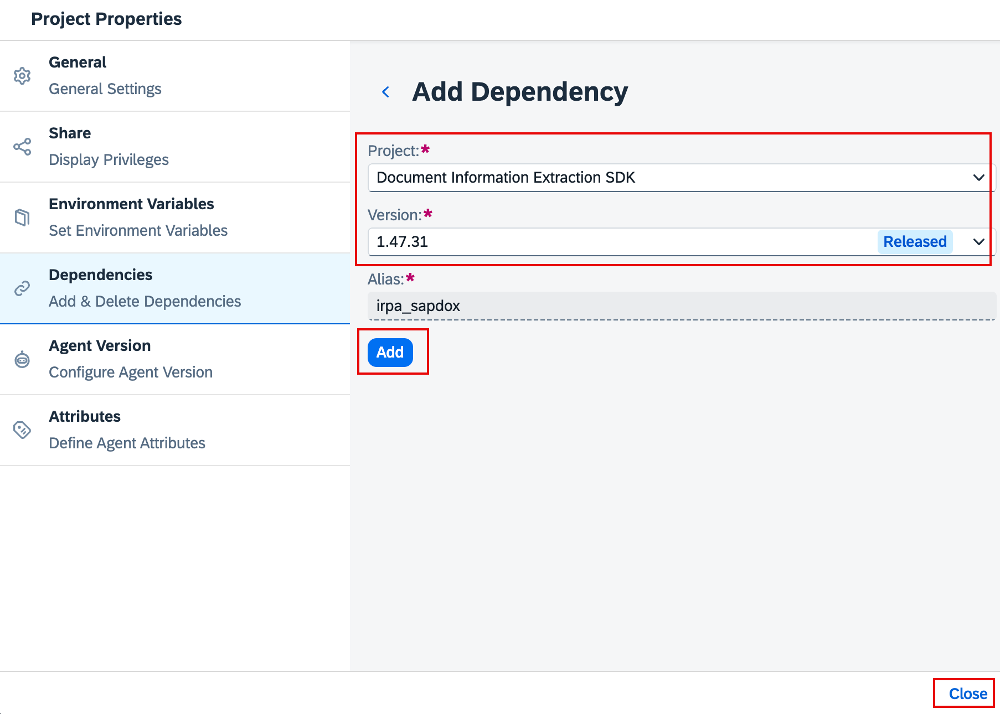
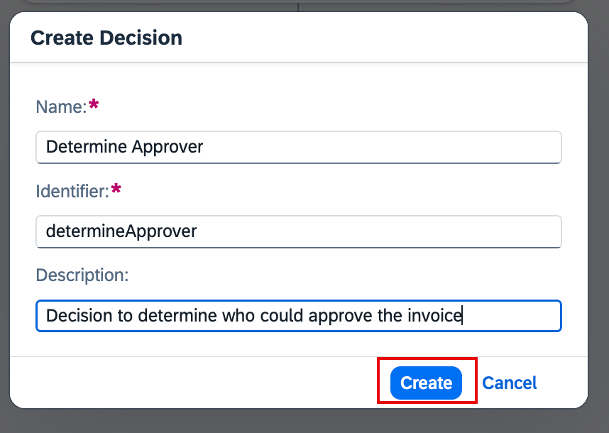
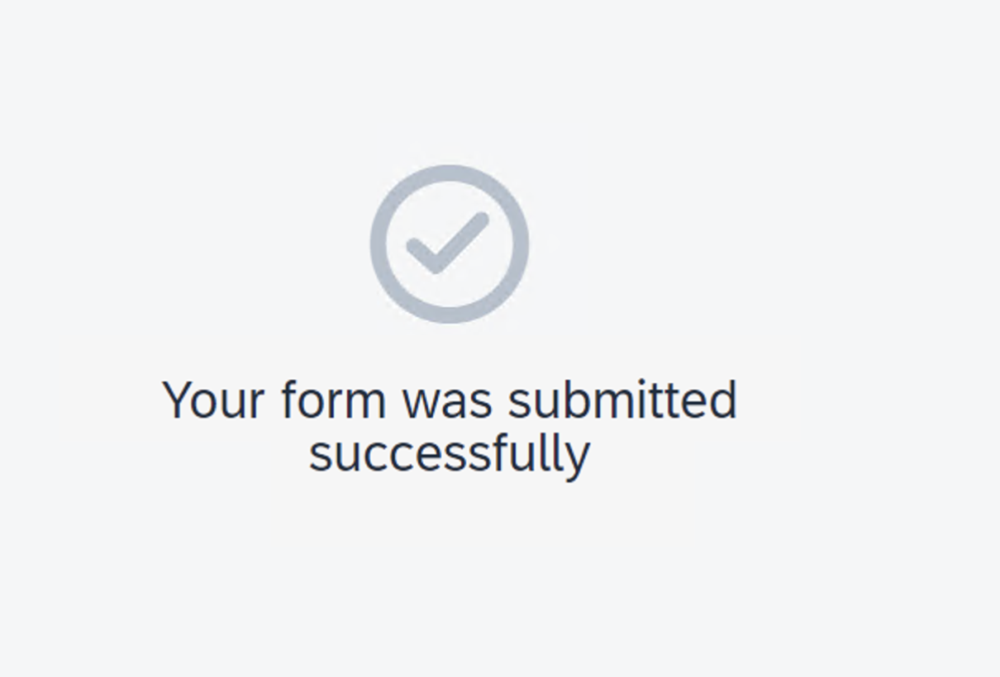
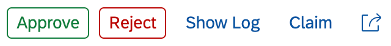

***Hands-on Exercise: Extract information from PDF***

**1.Create Process**

**Details**

You work in the finance department of the company and need to regularly
process incoming scanned invoices. This is actually causing a lot of
manual effort in order to extract the data out of the pdf or image, send
to the approval of the manager before the data would be actually entered
into the system. This needs to be automated since we are talking about
multiple invoices which are coming every single day. Also we need to
define the approval flow depending on the specific criteria (in this
tutorial series, company is considered as criteria).

**You will learn**

- How to create a project and the related process

- How to add a form to trigger this process

**About this Exercise**

In this exercise you create a process which houses all the project files
related to an automation, including bots, workflows, decisions and
forms. As part of this, you will define a set of inputs that will define
the location and information of the process trigger.

**Step 1: Create a Business Process Project**

The project includes all artifacts you will create during the course of
these tutorials. You can share, release, rename or delete these
projects.

1.  Once you have entered the Lobby, choose **Create**, then
    select **Build an Automated Process** followed by **Business
    Process**.

2.  In the wizard enter the **Project Name** Invoice Approval XX, where
    XX must be replaced with **your initials**, and also a **Short
    Description**, then choose **Create**.

**Step 2: Create a Process**

The process will describe the flow of the activities.

1.  Maintain the **Name:** **Get Invoice Details** and also
    the **Description: Process to approve invoices**. The identifier
    will be created automatically.

>   />
>
> The process with a start and end event is now available for you.

**Step 3: Define the Form to Start the Process**

When working with SAP Build Process Automation, processes can be
triggered by a variety of ways such as an API, a form and schedules. In
this example, we will build a form that a user will enter information
into to trigger the process.

1.  In the canvas

    - Select **Add a Trigger**

    - Select **Forms**

    - Select **Blank Form**.

>   />

2.  Provide the following information and choose **Create**:

| **Field Name** | **Value**                     |
|----------------|-------------------------------|
| Name           | **Invoice Request Form**      |
| Description    | **Form to start the process** |

Note: Identifier will be filled automatically.

> In the form you have multiple layout and input elements.

- Click on '...' next to the newly created form and open the Editor.

>   />

3.  Create a headline, drag and drop **Headline 1** into the canvas.

4.  Now, we will create the form layout the will be used to input the
    relevant information for the process:

    - Add a Headline 1 called: Invoice Request Form

    - Add a Paragraph: Please provide the following details to start the
      process

5.  Now, let's add some input fields into the form that need to be set
    to required:

| **Input Field Type** | **Name**          | **Settings** |
|----------------------|-------------------|--------------|
| Text                 | **Employee Name** | **Required** |
| Text                 | **File Path**     | **Required** |
| Date                 | **Current Date**  | **Required** |

6.  Save the changes.

>  

**2.Create Automation**

## **Prerequisites**

- Complete **1 Create Process** tutorial

- Download the [Invoice
  Document](https://sap-my.sharepoint.com/:b:/p/floria_qian01/Eb87mRUsy0xPqP9g1D8YEnoBrZVdxre9XRN5zIGr5krn5Q?e=Na0L8l) to
  your local machine

## **Details**

### **You will learn**

- How to extract data using Document Extraction Template

- How to bind parameters between process and automation

### **Step 1: Create Automation**

1.  In the process **Get Invoice Details**:

    - Choose  .

    - Select **Automation** \> **Blank Automation**.

2.  A pop-up will appear to configure the Desktop Agent version. Do the
    following in the pop up: - In case you have the pop-up window,
    saying "Detecting Agent...", please click on "Skip" button. - In the
    next pop-up select the version of the Desktop Agent installed on
    your machine from the dropdown. During the exercise we would use
    version **3.22**; so please select it from the dropdown.

    - Choose **Confirm**.

> It would be with suffix as **Registered**.
>
>   />

3.  A new pop-up will appear to create the automation. Enter the
    following:

    - Name: **Extract Invoice Data**.

    - Description: **Extract data from invoice**

    - Click **Create**.

An automation **Extract Invoice Data** will be created successfully and
presented in the screen.

### **Step 2: Create Data Types**

1.  Click the **Open Project Content** symbol on the left of your screen
    \> Create \> **Data Type**.

>   />
>
>   />

2.  Enter the name of the data type as **Invoice** and
    choose **Create**.

3.  Select New Field and add the following information, then save once
    finished

| **Field Name** | **Type** |
|----------------|----------|
| DocumentNumber | String   |
| GrossAmount    | Number   |
| SenderName     | String   |

### **Step 3: Create Input and Output Parameters**

Input and output parameters allow you to exchange data in the workflow
of your automation between activities, screens, and scripts.

1.  Now we will create the input and output parameters in you
    automation.

    - Click on the left panel to view your artifacts

    - Select Extract Invoice Data

    - Click on the canvas

2.  Under input and output, add the following information, one by one.

| **Parameter Name** | **Data type** | **Parameter Type** | **Description**                           |
|--------------------|---------------|--------------------|-------------------------------------------|
| FilePath           | **String**    | **Input**          | Path where the invoice document is stored |
| InvoiceDetails     | **Invoice**   | **Output**         | Extracted Invoice Details                 |

3.  Choose **Save**.

### **Step 4: Configure Pre-Trained Data Extraction Model**

In this step, we will define the headers that a pre-trained model will
extract from our invoice.pdf.

1.  For the automation to work, we need to apply dependencies to the
    system configuration in order to work with the Document Information
    Extraction Activities

    - Click on the cogwheel at the top of your screen

    - Select Dependencies

    - Select Add Dependency to add a Business Process project dependency

    - Select Document Information Extraction SDK to add the latest
      version

    - Click Add and close

2.  In this part, we will add a pre-trained model for an invoice to
    extract the necessary information from our invoice.pdf

- Click on the canvas

- In the tools panel, search **extract data**

- Add **Extract Data (Pre-trained Model)** into the automation

>   />

3.  Now we will configure the pre-trained model

- Select the Extract Data (Pre-trained model) step to open its
  configuration panel

- Select Document Type: **Invoice**

- Select **FilePath** for documentPath

4.  Next, we will add the data type **invoice** which we created in Step
    1

- Click on the canvas to open the tools panel

- Search **invoice**

- Click and drag invoice data type into the flow

5.  Configure input parameters for **Create Invoice Variable**

- Click on Create Invoice Variable

- Under value, select **Create Custom Data**

Note: Document Number, Gross Amount and Sender Name have been
prepopulated as we defined these as outputs of the data type Invoice
earlier.

- Click on the Pencil icon to open the expression editor.

> Here we will be able to see all of the header fields associated

- To write the expression, we will use the dropdown options

<!-- -->

- Variables \> extractedData \> headerFields \> documentNumber \>
  Click **Value**

- An expression is
  generated: **Step1.extractedData.headerFields.documentNumber.value**

- Click Check, then **save** your expression

>   />

- Complete the same steps for **Gross Amount** and **Sender Name**

<!-- -->

- Gross Amount: **Step1.extractedData.headerFields.grossAmount.value**

- Sender Name: **Step1.extractedData.headerFields.senderName.value**

- Change output parameter to: **myinvoiceData**

- At the end, you should have something that looks like this:

> 

6.  Add a log message to view the output of the automation

    - Click on the canvas

    - Search **Log Message**

    - Add to your automation flow

    - Add **myinvoiceData** to the message field.

### **Step 5: Passing the Parameters Outside the Automation**

1.  Select the **End** and pass the variable myinvoiceData to the output
    parameter InvoiceDetails which you have created earlier.

2.  **Save** the automation.

### **OPTIONAL** Step 6: Test the Automation (Requires Desktop Agent)

We are using virtual desktop machines connected to the tenant, so please
proceed to **Step 7**.

1.  Select Test button and enter the FilePath where the invoice document
    is stored locally on your machine.

2.  The automation opens the Invoice Document, extracts data and prints
    the details i.e Document number, Gross amount and Sender name.

3.  Your automation is built successfully.

### **Step 7: Mapping of Parameters to the Automation and Process**

1.  Navigate to the process **Get Invoice Details** and select the
    automation **Extract Invoice Data**.

2.  Map the input parameters of the automation to the form
    parameter FilePath.

3.  Your process looks like below once you complete this tutorial.

**3.Create Decision**

## **Details**

With a Decision you can include several policies, guidelines, business
rules and so on into your process flow.

### **You will learn**

- How to create a decision

- How to make use of data types and how to create them

- How to maintain a decision table and include it in the process flow

Please note that the system flow may look slightly different due to the
recent updates.

### **Step 1: Add a decision and create a data type**

You will now add a decision to the flow of your process. With this you
are able to include business logic.

1.  In order to add an approval step, we need to create a data
    type **Approver**

    - Click on  on the left of your
      screen

    - Select Create \> Data Type

2.  Enter the following information

    - Name: **Approver**

    - Description: **Approvers Email Address**

    - The **Identifier** will be created automatically.

    - Choose **Create**.

>   />

3.  Create a **New Field**.

4.  Enter the **Name** **eMail**, leave the **Type** as **String**.

5.  The new data type containing the email address of the approver is
    now created. **Save** your work.

6.  Now we can create our decision to determine approver.

    - Navigate back to your **Get Invoice Details** process via the tab

    - Click on **+** after the automation **Extract Invoice Data**

    - Select **Decision** \> **Blank Decision** to add a new one.

7.  Enter the **Name** **Determine Approver** and also
    a **Description:Decision to determine who could approve the
    invoice**, the **Identifier** will be created automatically.
    Choose **Create**.

>   />

8.  The Decision **Determine Approver** is now in the process, choose
    the three dots and select **Open Editor**.

>   />

9.  You see a **Decision Diagram** showing the flow of the data within
    the Decision. Here we need to add an input and output parameter:

    - Click on **Add Input Parameter**

    - Enter the following information for Input:

      - Name: **Determine Approver**

      - Description: **Determine approver input**

      - Type: **Invoice**

    - Click on **Add Output Parameter**

    - Enter the following information for Output:

      - Name: **determineApprover**

      - Description: **Determine approver output**

      - Type: **Approver** (What we created earlier in this exercise)

    - Your decision should look like the following

### **Step 2: Create a decision table**

There are many ways to express a business rule, in this case you will
create a decision table to determine the approver of the invoice based
on certain criteria.

1.  Choose **Add Rule**.

2.  Enter the following information:

    - Rule Name: **DT Determine Approver**

    - Description: **Decision table to determine the approver**

    - Click on **Next Step**

3.  We need to configure the condition:

    - Click on the dropdown of input parameter **Determine Approver**

    - Select **Sender Name**

4.  Click on **Next Step**.

>  alt="Next Step" />

5.  Now we need to configure the output parameter:

    - Click on the dropdown of **determineApprover**

    - Select **eMail**.

6.  Select **Next Step** to review.

7.  Choose **Create** to create the rule.

8.  If you need to edit the rule, select the Pencil icon at the top

9.  Now we need to define the attributes of the Determine Approver rule.

    - Determine Approver: **EXISTSIN\['ABC Communication'\]**

    - eMail: '**\<Your SAP BTP User ID Email\>**' e.g.
      '<john.doe@mail.com>' Hint: as this is in string format, the email
      address needs to be in single quotes.

> Now, when an invoice contains the name "ABC Communication", the
> approval request will be sent to you.

10. Do the same for a company called Telecommunications

    - Select **Add Row**

    - Click on **Insert After**

    - Determine Approve: **EXISTSIN\['Telecommunications'\]**

    - eMail: '**\<Your SAP BTP User ID Email\>**' e.g.
      '<john.doe@mail.com>' Hint: as this is in string format, the email
      address needs to be in single quotes.

11. **Save** your work, your decision table is ready.

### **Step 3: Maintain input and output of the decision**

Though the Decision is ready, you need to connect it to the data flow of
your process and define which data should be the input and output here.
Also to get rid of this error marker.

1.  Go back to the process and select the Decision.

> Note: You might not see entries in the Input. This is due to a bug. As
> a workaround, click on the three-vertical-dot and delete the decision.
> Add the decision again in the process.
>
> Please refer to [the Knowledge Base
> Article](https://launchpad.support.sap.com/#/notes/3207153) for the
> complete workaround.

2.  Define the input, select **InvoiceDetails**.

3.  Just check the **Output**, it is **eMail**, as you have defined it
    in the decision itself. **Save** your work.

You have now defined who should approve the invoice, based on the
company name. Next you will use the outcome of the business rule, the
email address, as input for the approval.

**4.Create Forms**

**Details**

There are different requirements and business situations when a form is
needed in a business process. You have already created a form to start
the process. Most often you probably need a form to maintain some input
data or to approve or reject a request or even to send out some
notifications. The two latter ones are your focus now.

**You will learn**

- How to leverage the result of the Decision in an approval form

- How to create an approval form

- How to create forms to notify process participants

**Step 1: Create New Approval Form**

1.  Choose **+** at the connection flow after the decision **Determine
    Approver** to open the context menu. Then select **Approvals \>
    Blank Approval Form**.

>   />

2.  Maintain the **Name** **Invoice Approval Process** and also
    the **Description** **Form to approve the invoice**.
    Choose **Create**. The **Identifier** is created automatically.

>   />

3.  Choose the three dots on the created form's artifact and
    select **Open Editor** to do the same. Just ignore the red frames,
    you will fill them later.

> 

4.  Now you are in the Form's Editor, where you can define the layout
    and input fields. First add via drag and drop a new **Headline
    1** to the canvas. Provide this headline **Invoice Approval**.

> 

5.  Drag and drop a **Paragraph** into the canvas. Insert **Invoice
    Details** in the paragraph.

> 

6.  Include a **Text** field in your form.

7.  Change the name to **Company Name** and select **Read Only**, as you
    will display here some information from the process content.

8.  Add some further input fields to your form. Please ensure you have
    selected the correct type and also maintain all of them as **Read
    Only**.

| **Field Type** | **Name**           |
|----------------|--------------------|
| Text           | **Invoice Number** |
| Number         | **Gross Amount**   |
| Text           | **Employee Name**  |

9.  You are done with the layout and input fields of the approval
    form. **Save** your work.

10. Go back to your process, you will recognize some errors, e.g. inputs
    are missing. No need to worry, you will provide the required details
    in the next steps.

11. Select the **Invoice Approval Form** and in the **General** tab of
    the form properties, move to **Subject** and choose **Select Item**.

12. Enter the text **Please approve the invoice** and add the process
    content **Document Number**. You will find this underneath **Invoice
    Details**. This combines plain text with process-related information
    and serves as an unique identifier for the end user.

> 

13. In the Decision you have defined the approver of the invoice. The
    output of the decision has been an email address. Now add from the
    process content within **determine Approver
    Output** the **eMail** in the **Recipients** as **Users**. Now only
    the selected approver will get this approval in the inbox.

14. Switch to the **Inputs** tab and within **Employee
    Name** choose **Select Item**. The process content will be opened
    again.

>   />

15. Now add the attributes from the process content to the related input
    fields.

> You can only assign fields with the same type, e.g. text in the
> process content to text input field. If you cannot assign, e.g.
> Invoice Number from the process content to the Invoice Number in the
> input field, the type of the input field might be wrong. If so, please
> correct your form.

| **Process Content** | **Input Field** |
|---------------------|-----------------|
| Employee Name       | Employee Name   |
| Company Name        | Sender Name     |
| Gross Amount        | Gross Amount    |
| Invoice Number      | Document Number |

|     |     |
|-----|-----|
|     |     |
|     |     |
|     |     |
|     |     |

> 

16. As this mapping of process content and forms is quite important to
    ensure a proper flow of the relevant data in your process, please
    check them again. It should look like this.

>   />

**Step 2: Create Approval Notification Form**

1.  Choose the **+** of the control flow for **Approve** coming from
    the **Invoice Approval Form** you have just created. In the context
    menu, select **Forms \> Blank Form**.

>   />

2.  Maintain the **Name** **Invoice Approval Notification Form** and
    also the **Description** **Form to notify about the approved
    invoice** and choose **Create**. As always, the **Identifier** has
    been created automatically.

>   />

3.  In the newly created **Invoice Approval Notification Form**, choose
    the three dots and select **Open Editor**.

4.  In the form, add a headline **Invoice Approval**, a paragraph **Your
    invoice has been approved.** and also a text field **Invoice
    Number** and select here **Read Only**. **Save** your work.

5.  Go back to the process select **Invoice Approval Notification
    Form** to maintain the information in **General** tab.

6.  Maintain **Subject：Approved Invoice,** mapping **document number**
    and select for the **Users** in this case **Process Started
    By** from the process content.

7.  Select **Inputs** tab and assign the **Document Number** from the
    process content here.

8.  **Save** your work.

**Step 3: Create Rejection Notification Form**

1.  Select **+** of the **Reject** control flow from the **Invoice
    Approval Form**. Select **Forms \> Blank Form**.

2.  Maintain the **Name** **Invoice Reject Notification Form** and also
    the **Description** **Form to inform about the rejected
    invoice** and choose **Create**. As always, the **Identifier** has
    been created automatically.

>   />

3.  In the newly created **Invoice Reject Notification Form**, choose
    the three dots and select **Open Editor**.

4.  In the form, add a headline **Invoice Rejection**, a
    paragraph **Your invoice has been rejected.** and again also a text
    field **Invoice Number** and select here **Read
    Only**. **Save** your work.

5.  Go back to the process, select **Invoice Reject Notification
    Form** to maintain the information in **General** tab.

6.  Maintain **Subject** and select for the **Users** in this
    case **Process Started By** from the process content.

> 

7.  Select **Inputs** tab and assign the **Invoice Number** from the
    process content here.

8.  Add an end event, choose the **+** of the control flow from
    the **Invoice Reject Notification Form** and select **Controls \>
    End**.

9.  Your process is ready to be released, deployed and
    executed. **Save** your work.

5.Run Process

**Details**

Till now, you have developed a Business Process where you will start
with a form to enter your name as the processor and the file path where
the invoice is stored. Then you would need to upload and annotate the
invoice in order to get the data from the relevant fields by the bot:
company name, invoice amount and document number. Bot will extract this
data. After this you need to decide, who would be the approver (so you
need to enter your email). Then you need to build the approval form to
review the submitted data and approve it for further processing.

**You will learn**

- How to release, deploy and run the Process

- How to work on the Tasks

- How to monitor the Process

**Step 1: Release Business Process Project**

Before you run the process, ensure that the process is saved and that
there are no errors showing in the Design Console. To run the process,
you must first release and then deploy the Business Process project.
Releasing a project creates a version or snapshot of the changes.

1.  In the Process Builder, choose **Release**.

> 

2.  Add a **Version Comment** if needed and choose **Release**.

>   />

3.  The project released successfully and is ready to be deployed.

> If needed, you can refer to
> the [<u>Documentation</u>](https://help.sap.com/docs/PROCESS_AUTOMATION/a331c4ef0a9d48a89c779fd449c022e7/5ec3714e12ce487da35c009505eaf3a5.html?version=Cloud).

**Step 2: Deploy the Released Process**

You can deploy Business Process projects from each released version of
the project in the Process Builder or through the Lobby. Deploying the
project makes it available for others to use it. Bare in mind that you
can only deploy a released version of the project.

1.  From the released version of the Business Process project in the
    Process Builder, choose **Deploy**.

> 

2.  In this case there are no **Variables** to set.

> **What's going on?**
>
> Variables allow you to reuse certain information for a given Business
> Process project deployment. You use variables to pass parameters to
> automations. You can create variables in the Process Builder for which
> you can later set values when deploying the Business Process project.

3.  Choose **Public** environment and **Deploy**.

> 
>
> To Deploy will take a couple of seconds/minutes depending upon how big
> your project is and how many different skills it has. Any errors
> during the deployment will be shown in the Design Console.

4.  The project deployed successfully and is now ready for running and
    monitoring.

> Once the deployment is successful, you will see a changed status. You
> can also see all your deployed and/or released project versions from
> the project status list next to the project name.

You cannot edit released or deployed projects. To continue working on
your project, you need to select the Editable option from the list of
released versions.

Now that you have successfully deployed your project, it is time to run
the process and see the results.

**Step 3: Run the process**

1.  From the deployed version of the Business Process project in the
    Process Builder, open the process **Get Invoice Details**.

2.  Select **Invoice Request Form**.

3.  Choose the **Copy** icon aside the **Form Link** in the **Trigger
    Settings**.

> 

4.  Open the Form pasting the **Form Link** in a browser window.

5.  Fill the **Invoice Request Form** and choose **Submit**.

> Do not enter any random value or else the Automation will not give any
> results. Use the following value for the FilePath:
> "*C:\Users\student\Desktop\invoice.pdf*"

6.  The process is triggered. You can now work on the tasks and monitor
    the process.

>   />

**Step 4: Work on the Tasks**

1.  Start in the **Lobby** and open the **My Inbox** application by
    selecting the button  at the top right corner.

2.  After opening the **My Inbox** application, you will see on the
    left-hand side all the tasks listed. Select the task with the
    invoice number with which you triggered the process.

3.  Move on with one of the actions:

- **Approve**, **Reject**, **Show Log** (to see what has been done so
  far),

- **Claim** (to reserve this task for you) or

- **Mail** (to forward this task via email).

4.  You could also **sort**, **filter** or **group** the tasks at the
    bottom of the task list with these buttons:

>  alt="My Inbox Filter" />

5.  Depending on your selected actions and the information you have
    provided at the start of the process, the next task would be
    to **Approve** the invoice.

**Step 5: Monitor Process and Automation**

1.  Navigate to the **Monitor** tab and choose **Process and Workflow
    Instances**.

2.  Choose **Get Invoice Details** instance to check the status of
    the **CONTEXT** and **EXECUTION LOG**.

3.  Go to **Automation Jobs** under **Monitor**. You can see the
    Automation ran successfully:

#### Congratulations! You have finished the exercise!
